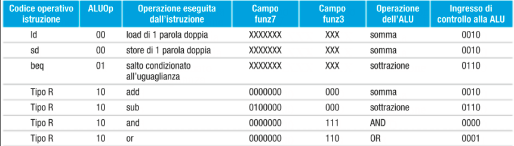
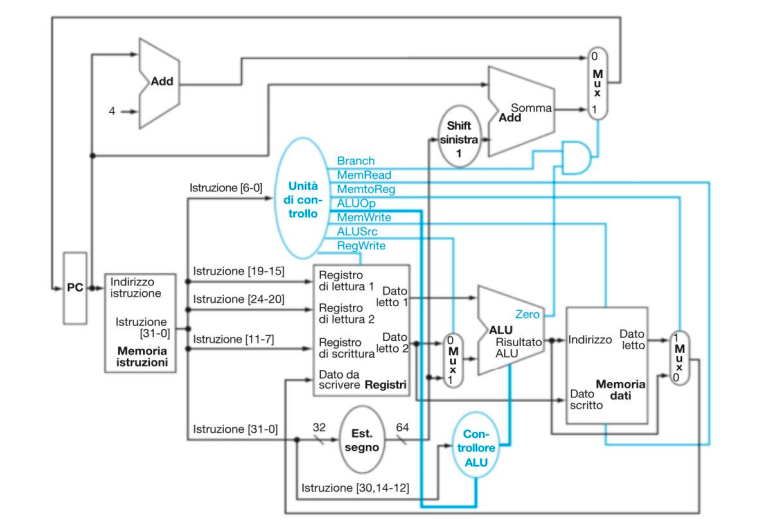

# Calcolatori (Teoria)

---

- [Calcolatori (Teoria)](#calcolatori-teoria)
  - [Toolchain](#toolchain)
  - [Assembler](#assembler)
  - [File Oggetto](#file-oggetto)
  - [Linker](#linker)
    - [Tipi di Simboli](#tipi-di-simboli)
    - [Linking phase](#linking-phase)
    - [Librerie](#librerie)
      - [Lazy linking](#lazy-linking)
  - [Il Processore](#il-processore)
    - [Concetti di reti logiche](#concetti-di-reti-logiche)
  - [La Pipeline](#la-pipeline)
    - [⚠️ HAZARD](#️-hazard)
      - [Hazard Strutturali](#hazard-strutturali)
      - [Hazard sui dati](#hazard-sui-dati)
      - [Hazard sul controllo](#hazard-sul-controllo)
  - [Gerarchia di Memoria](#gerarchia-di-memoria)
    - [Memorie RAM](#memorie-ram)
      - [a semiconduttori](#a-semiconduttori)
      - [statiche (SRAM)](#statiche-sram)
      - [dinamiche (DRAM)](#dinamiche-dram)
          - [Fast Page Mode:](#fast-page-mode)
      - [DRAM sincrone](#dram-sincrone)
      - [Double-Data-Rate SDRAM (DDR-SDRAM)](#double-data-rate-sdram-ddr-sdram)
    - [Gerarchia](#gerarchia)
      - [Gestione](#gestione)
      - [Località](#località)
      - [Termini Tecnici](#termini-tecnici)
    - [Cache](#cache)
      - [a mappatura diretta](#a-mappatura-diretta)
        - [Gestione di una miss](#gestione-di-una-miss)
        - [Scrittura](#scrittura)
      - [associative](#associative)
      - [set-associative](#set-associative)

---

## Toolchain

Ovvero il processo di generazione del linguaggio macchina. La conversione è effettuata dal **compilatore**.

1. **Preprocessore**: gestisce le direttive `#`, in pratica sostituisce pezzi di codice.
2. **Compilatore**: passa da C a Assembly (`.s`)
3. **Assembler**: passa da Assembly a linguaggio macchina (`.o`)
4. **Linker**: mette assieme codice in linguaggio macchina e librerie per generare un eseguibile

Di tutto questo si occupa un _driver_ el'eseguibile può essere caricato tramite la system call _exec()_

`gcc` invoca:

1. cpp
2. cc: conosce l'architettura target - possibili ottimizzazioni
3. as
4. ld

## Assembler

L'**assembler** si occupa anche di altre cose:

- convertire istruzioni/numeri (pseudo istruzioni come `mv` e `j`)
- gestire label e salti
- generare meta-dati

## File Oggetto

È composto da:

- **Header**: dimensione e posizione degli altri segmenti del file
- **Segmenti**:
  - **di Testo**: contiene il codice in linguaggio macchina
  - **dati statici**: contiene i dati allocati per la durata del programma
- **Tabella dei simboli**:
  - Associa simboli a indirizzi
  - Enumera simboli non definiti
- **Tabella di rilocazione**:
  - Enumera istruzioni da _patchare_ (indirizzi assoluti)

## Linker

Mette assieme uno o più file oggetto eseguendo le rilocazioni. Praticamente elimina lee tabelle dei simboli e di rilocazione mettendo assieme tutto quello che ha a disposizione.

### Tipi di Simboli

- definiti: associati a un indirizzo relativo
- non definiti: usati in un file ma definiti in uno diverso
- locali: definiti e usati in un file ma non usabili in un altro file

In ogni caso a ogni simbolo viene associato un indirizzo assoluto.

### Linking phase

1. Dispone i segmenti in memoria
2. Assegna un indirizzo assoluto a ogni simbolo
3. Corregge le varie istruzioni con indirizzi calcolati
4. Incapsulamento nell'eseguibile

### Librerie

Ovvero collezioni di file `.o`

- **Librerie statiche `.o`**: collezioni di file oggetto, ld fa tutto il lavoro (ma occhio alle dimensioni dell'eseguibile)
- **Librerie dinamiche `.so`**: il linking avviene a tempo di esecuzione
  - usa riferimenti a librerie ma non le include, ogni eseguibile hah infatti un _linker dinamico_

#### Lazy linking

Il linking non viene fatto durante il caricamento ma in maniera dinamica a runtime. Viene in fatti chiamato uno **stub** che si occupa di caricamento, rilocazione e linking

## Il Processore

### Concetti di reti logiche

**rete logica combinatoria**: circuito composto da porte logiche che produce un output statico dell'input

**elementi di stato o sequenziali**: perché l'uscita a un ingresso dipende anche dagli ingressi precedenti

## La Pipeline

Chiaramente non si spreca tempo con una sola istruzione per tutti i passaggi. Qui entra in gioco la **pipeline**

A dettare il periodo di clock sono ovviamente le istruzioni più lente.

**Vantaggi del RISC**:

- Istruzioni della stessa lunghezza
- Codici operandi in posizioni fisse
- Si può usare la alu per il calcolo degli indirizzi (accesso in memoria solo a ld/st)
- Gli accessi avvengono in un solo stadio della pipeline

### ⚠️ HAZARD

#### Hazard Strutturali

Causati dall'architettura, ad esempio non posso caricare istruzioni e memorizzare operandi nello steso ciclo

#### Hazard sui dati

Quando la pipeline è in stallo in attesa di informazioni di stadi precedenti. Si può vedere quando due istruzioni usano lo stesso registro e sono vicine. Per risolvere basta **scambiare le posizioni delle istruzioni** ottimizzando la pipeline.

Un'altra alternativa, implementata dal processore, può essere quella di avere un collegamento diretto dell'uscita con l'ingresso delle istruzioni successive. Questa operazione è chiamata **operand forwarding**. (occhio comunque alla validità)

#### Hazard sul controllo

Riguarda i salti condizionati. Possono dover aspettare risultati di istruzioni precedenti. Si cerca quindi di predire i salti assumendo che il salto non venga effettuato e correggendosi in caso contrario. Esistono soluzioni migliori e molto più complesse.

## Gerarchia di Memoria

Possiamo distinguere due tipi di memorie:

- **memoria indirizzata direttamente**
  - volatile
  - limitata dallo spazio di indirizzamento del processore
  - accessibilità immediata
- **memoria indirizzata indirettamente**
  - permanente
  - spazio indirizzato "software"
  - deve essere caricata in memoria per essere accessibile

**Terminologia**:

- tempo di accesso = singola operazione r/w
- tempo di ciclo = tempo tra due operazioni in locazioni diverse
- accesso
  - casuale
  - sequenziale
- RAM e ROM (si insomma la solita fuffa)

La memoria principale ha diversi bus: uno per gli indirizzi (tramite Memory Address Register), uno per i dati (tramite Memory Data Register) e uno per le linee di controllo (R/W/Memory Function Completed).

### Memorie RAM

_definizioni_

- **latenza** = tempo di acceso add una singola parola
- **velocità** o **banda** = velocità di trasferimento massima in [FPM](#fast-page-mode).

#### a semiconduttori

Memorizzano singoli bit, organizzati in byte/word. A seconda del parallelismo la memoria è organizzata in modo diverso.

> capacità N
> parallelismo P
> es. $512K \cdot 1 || 128K \cdot 4 || 64K \cdot 8$

#### statiche (SRAM)

In queste memorie i bit possono essere tenuti indefinitamente, sono molto veloci, consumano poco ma costano una fracca di soldi. Sono caratterizzate da due linee di dati _b_ e _b'_ e una linea di controllo che agisce sui transistor per settare un latch.

#### dinamiche (DRAM)

Sono le memorie più diffuse, economiche e and alta densità. Hanno bisogno di un _refresh_ (condensatore) per mantenere il loro valore. In scrittura il transistor si accende e copia sul condensatore il valore della linea. In lettura il _sense amplifier_ controlla la soglia. Se il valore del condensatore è superiore a quello della soglia, attiva la linea dati ricaricando il condensatore. Se il valore è inferiore mette a terra e scarica il condensatore. Per fare un _refresh_ quindi basta una lettura, effettuata dad un circuito apposito. Essendo di dimensione così grande i riferimenti a posizioni di memoria vanno in byte e non bit.

###### Fast Page Mode:

ovvero evitare la lettura di una stessa riga per accessi contigui.

#### DRAM sincrone

La questione del refresh può dare fastidio durante un'eventuale scrittura. Viene quindi aggiunto un latch per rendere il circuito sincrono e indipendente.

#### Double-Data-Rate SDRAM (DDR-SDRAM)

DRAM sincrona che consente spostamenti sia sul fronte positivo che negativo.

- latenza === SDRAM
- banda doppia
- organizzate in banchi _pari_ e _dispari_

### Gerarchia

#### Gestione

- **piatta**: Ogni accesso lo richiedo singolarmente. Alta capacità, tempo sprecato per recuperare le informazioni.
- **veloce**: Tengo tutto in memoria ottimizzando i tempi ma ho poca capacità.
- **gerarchica**: Se non già in memoria richiedo le informazioni quando servono. Con memoria piena comincerò a spostare le informazioni che non servono per fare spazio.

#### Località

- **spaziale**: quando si fa riferimento a una locazione nei passi successivi, queste locazioni sono vicine
- **temporale**: quando si fa riferimento a una locazione, la si riutilizzerà a breve termine con un'elevata probabilità.

#### Termini Tecnici

- **blocco**: unità minima di informazione
- **hit-rate**: percentuale di accessi nel livello superiore
- **miss-rate**: percentuale di accessi _non_ nel livello superiore
- **tempo di hit**: tempo di accesso per un accesso a livello superiore
- **penalità di miss**: tempo di accesso per un accesso _non_ a livello superiore

> penalità di miss >> tempo di hit
> aka ridurre la frequenza di miss

### Cache

#### a mappatura diretta

A ogni indirizzo della memoria corrisponde una precisa locazione della cache

$$block = block_{address} \% n_{blocks} $$

$$block_{address} = \frac{Data_{address}}{Block_{dimension}} $$

> per maggiori informazioni [pagina 22](https://didatticaonline.unitn.it/dol/pluginfile.php/1572741/mod_resource/content/1/lect22.pdf)

Quindi cache grandi =

1. migliore località spaziale,
2. migliore miss-rate (minore),
3. scarsa località temporale,
4. alto costo di gestione dei miss

##### Gestione di una miss

1. PC = PC-4
2. Lettura in memoria
3. Scrivere il blocco aggiornando il tag
4. Far ripartire l'istruzione originale

##### Scrittura

Viene usata la politica **write-through**, dove la scrittura è immediata in memoria, usando la cache come buffer, oppure **write-back**, dove la scrittura è immediata in cache, e solo quando la cache si scarica viene sovrascritta la memoria.
es. _Fast Math Intrinsity_

#### associative

Posso mappare qualsiasi blocco in qualsiasi blocco di cache. Dovrei tuttavia cercare ovunque il mio dato.

#### set-associative

Sono una via di messo tra le due: ogni blocco di memoria può essere mappato su una linea di n-blocchi diversi di cache. La ricerca parallela viene quindi effettuata su una sola riga e non su tutte come nell'associativa.

$$line = block_{address} \% n_{lines} $$

La frequenza di miss si riduce, ma ciò porta complessità nell'architettura.

_es._

| Associatività | Miss-Rate |
| :------------ | :-------: |
| 1             |   10.3%   |
| 2             |   8.6%    |
| 4             |   8.3%    |
| 8             |   8,1%    |

La set associativa porta un altro **svantaggio**: che blocco in cache sostituirlo quando è piena. Diverse politiche come FIFO o LRU (Least Recently Used) possono risolvere questo problema.

_continua..._

(parte mancante I/O)
