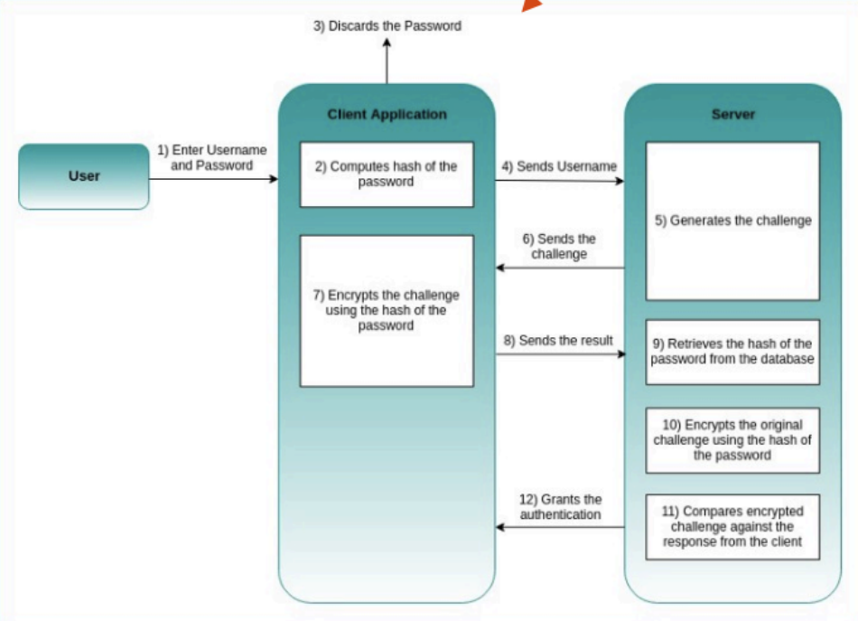
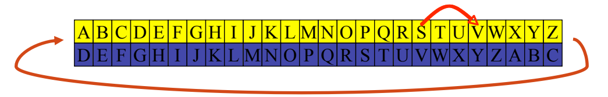
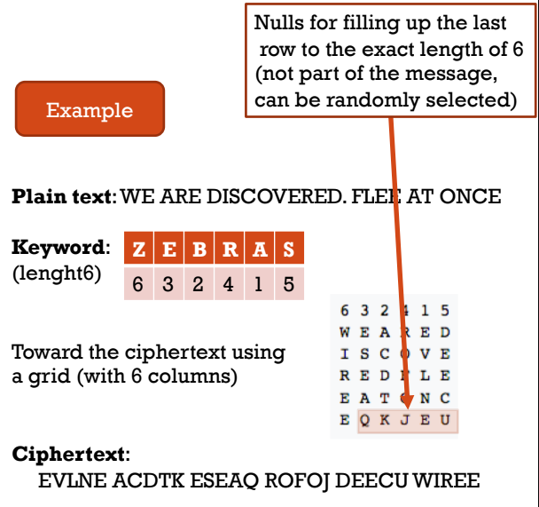
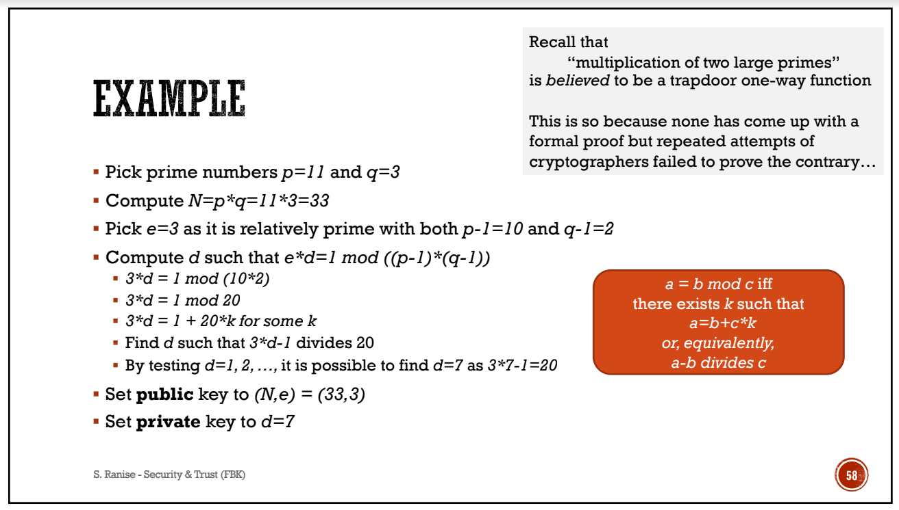
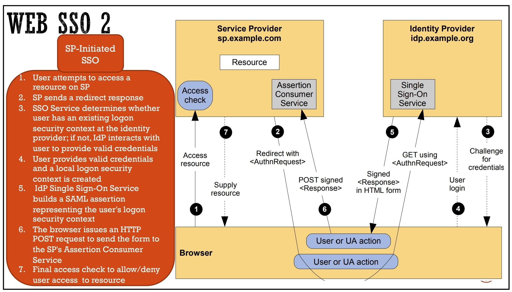

- [Basics](#basics)
  - [The CIA Triad](#the-cia-triad)
    - [Confidentiality](#confidentiality)
    - [Integrity](#integrity)
    - [Availability](#availability)
  - [Security Policies and Mechanisms](#security-policies-and-mechanisms)
  - [Risk](#risk)
  - [Security and Human Factors](#security-and-human-factors)
  - [More](#more)
- [Authentication I](#authentication-i)
  - [User Authentication and Digital Identity](#user-authentication-and-digital-identity)
    - [Digital Identity Lifecycle](#digital-identity-lifecycle)
  - [Passwords](#passwords)
    - [History](#history)
    - [Attacks and Mitigations](#attacks-and-mitigations)
    - [Password Managers](#password-managers)
  - [Protecting the password file](#protecting-the-password-file)
    - [Hashing](#hashing)
    - [Salting](#salting)
    - [Credential Stuffing](#credential-stuffing)
  - [Phishing](#phishing)
  - [Extensions of Password Based Authentication](#extensions-of-password-based-authentication)
    - [Multi-Factor Authentication](#multi-factor-authentication)
      - [One-Time Passwords](#one-time-passwords)
      - [PSD2](#psd2)
      - [Challenge-Response](#challenge-response)
      - [Smartphones as MFA](#smartphones-as-mfa)
      - [Problems](#problems)
      - [FIDO (not in the exam)](#fido-not-in-the-exam)
  - [Outsourcing Authentication (delegare)](#outsourcing-authentication-delegare)
    - [SSO (Single Sign On)](#sso-single-sign-on)
- [Introduction to Cryptography](#introduction-to-cryptography)
  - [History](#history-1)
  - [Cryptography](#cryptography)
  - [Cryptosystems](#cryptosystems)
  - [Keys](#keys)
  - [Computational Security](#computational-security)
  - [Encryption](#encryption)
    - [Substitution Cyphers](#substitution-cyphers)
      - [Caesar Cipher](#caesar-cipher)
      - [Vigeneré Cipher](#vigeneré-cipher)
    - [Transposition Ciphers](#transposition-ciphers)
      - [Columnar Cipher](#columnar-cipher)
    - [Modern Crypto](#modern-crypto)
      - [Symmetric Key Cryptography](#symmetric-key-cryptography)
      - [Stream Ciphers](#stream-ciphers)
      - [Block Ciphers](#block-ciphers)
        - [DES](#des)
        - [AES](#aes)
      - [Asymmetric Key Cryptography](#asymmetric-key-cryptography)
        - [RSA - Rivest-Shamir-Adleman](#rsa---rivest-shamir-adleman)
        - [DH - Diffie-Hellman](#dh---diffie-hellman)
- [Applications of Cryptography](#applications-of-cryptography)
  - [Remarks on PKC](#remarks-on-pkc)
  - [Public Key Infrastructure](#public-key-infrastructure)
    - [Digital Certificates](#digital-certificates)
  - [SSL/TLS](#ssltls)
    - [TLS in Client-Server Communication](#tls-in-client-server-communication)
    - [TLS Handshake Protocol](#tls-handshake-protocol)
    - [TLS for Authentication](#tls-for-authentication)
    - [TLS for Confidentiality](#tls-for-confidentiality)
    - [TLS for Integrity](#tls-for-integrity)
    - [TLS Vulnerablilities](#tls-vulnerablilities)
    - [Notes on TLS 1.3](#notes-on-tls-13)
- [Authentication II](#authentication-ii)
  - [Single Sign-On](#single-sign-on)
  - [SAML](#saml)
    - [SAML Assertions](#saml-assertions)
    - [SAML Protocol](#saml-protocol)
    - [SAML Bindings](#saml-bindings)
    - [SAML Profiles](#saml-profiles)
      - [Web Browser SSO Profile](#web-browser-sso-profile)
    - [Authentication Context](#authentication-context)
    - [Metadata](#metadata)
    - [Security Considerations](#security-considerations)
  - [National Identity Infrastructures](#national-identity-infrastructures)
    - [SPID (Sistema Pubblico di Identità Digitale)](#spid-sistema-pubblico-di-identità-digitale)
    - [CIE 3.0 (Carta d'Identità Elettronica)](#cie-30-carta-didentità-elettronica)
      - [Capabilities](#capabilities)
  - [European Identity Infrastructure](#european-identity-infrastructure)
    - [eIDAS (Electronic Identification and Trust Services for Electronic Transactions in the European Union)](#eidas-electronic-identification-and-trust-services-for-electronic-transactions-in-the-european-union)
- [Access Control](#access-control)

# Basics

## The CIA Triad

The CIA Triad stands for:

- **Confidentiality**: The information is only available to authorized users.
- **Integrity**: The information is not modified in an unauthorized way.
- **Availability**: The information is available when needed.

CIA Triad is essential to achieve security through security policies and mechanisms [🔗](#security-policies-and-mechanisms).

### Confidentiality

Confidentiality is the property that information is not made available or disclosed to unauthorized individuals, entities, or processes. Confidentiality is a key property of information security. Confidentiality is also a key property of data privacy.

Unauthorized access to sensitive information could be _intentional_ (intruder breaking into the network) or _unintentional_ (careless people).

Confidentiality is achieved by:

- **Encryption**: The process of encoding information. This prevents unauthorized individuals from reading the information.
- **Access Control**: The process of restricting access to a resource. This prevents unauthorized individuals from accessing the resource.

### Integrity

Integrity means guarding against improper information modification or destruction, including information _non-repudation_ (individual falsely denying haveing performed a particular operation) and _authenticity_ (property can be verified and trusted).

Integrity also means to have the ability to detect even the smallest change in the data.

Data integrity is compromised both through _human errors_ and _malicious attacks_.

Data integrity can be achieved by:

- **Version Control and Audit Trails**: The process of tracking and controlling changes to documents, computer programs, large web sites, and other collections of information.

It is and essential component for organizations whith certain regulations (ie. finanacial sector).

> Violation of data integrity can lead to _loss of trust_ and _loss of business_. [ie. bots on social media]

### Availability

Availability is the property that ensures information is accessible and usable upon request by an authorized entity. It also require the data to be protected from accidental interruption of access to the data.

Violation in availability is usually caused by an _infrastructire failure_ or a _DDoS attack_.

Availability can be achieved by:

- **Backup Systems and Disaster Recovery**: The process of creating a copy of data and storing it in a different location. This allows the data to be recovered in case of a disaster.
- **Cloud Computing**: The process of storing data on a remote server. This allows the data to be accessed from anywhere.

Low availability can impact _economy_ and _fundamental rights_.

## Security Policies and Mechanisms

**Security Policies** are the rules that define the acceptable use of a system. They are usually written in a document and are enforced by the system administrators.

**Security Mechanisms** are the technical solutions (usually rated) that implements the security policies. They are usually implemented by the system administrators.

**Security Services** are the capabilities that supports one or more of the security requirements (ie. CIA).

> Example: A company X can have a security policy that states that all employees must use a strong password. The security mechanism can be a password policy that requires a minimum of 8 characters, a mix of upper and lower case letters, numbers and special characters. The security service can be the password hashing algorithm. They might also have policies for visitors.

Some examples of security mechanisms are:

- **Authentication**: The process of verifying the identity of a user.
- **Authorization**: The process of giving access to a resource based on the user's identity.
- **Access Control**: The process of restricting access to a resource.

Some examples of security services are:

- **TLS protocol**: The protocol that provides privacy and data integrity between two communicating applications.
- **Access Control Lists**: The process of restricting access to a resource based on the user's identity.

CIA Triad is also essential not only to achieve security but also understand security violations.

> In a ramnsonware attack _Availability_ is violated, because access to file is blocked, but also _Confidentiality_ is violated, because the attacker could exfiltarte and read the files, and _Integrty_, beacuse files are encrypted and could be modified.

One way to mitigate security violations is **Zero Trust** which is a security model that requires all users to be authenticated, authorized and continuously validated to grant access to applications and data. This is a **Risk Management** approach.

## Risk

**Vulnerabilities** are weaknesses in a system that can be exploited by a threat to violate the security policy (ie. hidden backdoors, unknown software bugs, weak passwords).

**Threats** are potential sources of harm to a system (ie. hackers, viruses, natural disasters).

**Attack** is the exploitation of a vulnerability through a malicious activity to gain unauthorized access or attempt to compromise a system CIA.

[Cyber attacks try to readch as many victims as possible]

**Risk** is the probability of a threat exploiting a vulnerability to cause harm to the system.


**Considerations**:

- The human factor is crucial in mitigation measures: UX should be as frictionless as possible.
- A threat model is based on simplifying assumptions concerning the system/service and the capabilities of the attacker: we usually trust programmers (**trust assumptions**).
- Threat models are usefull for security experts but in reality they are **limited by budget and security skills**.
- Impact of an attack is relative to the stakeholder: a company might be more concerned about the loss of data than a user.

## Security and Human Factors

It is essential to understand that security is not only about technology, but also about people. They should be aware of the basics of security policies and mechanisms.

## More

- **Threat modellling is crucial**
- **Deploying security controls requires to consider several different aspects**
- **Security and Trust assumptions are essential**
- **Be careful with security control**
- **Security violations can be traced back to the CIA triad**

# Authentication I

## User Authentication and Digital Identity

Identity is the set of attributes that define a person. Attrbutes is a characteristic or property that describe a state, an appearance, or other aspect.

Digital identity is the set of attributes that define a person in the digital world.

> More on cross-border digital identity: eIDAS

### Digital Identity Lifecycle

1. **Enrollment**:

   The process of creating a digital identity; also called **Identity Proofing**.

   1. An individual is uniquely identified (ie. passport, driver's license) by _Personal Identifiable Information_ (Full Name, Date of Birth, Address, ...).
   2. Evidence is validated (check of information provided by the individual).
   3. Real world identity is mapped to a digital identity.

   **Identity Assurance Levels** are a categorization of the level of confidence that an identity is valid. They are usually based on the level of evidence provided by the individual.

   - I: self-asserted;
   - II: remote or in-person;
   - III: in-person.

2. **Authentication**:

   The process of verifying the identity of a user.

3. **Authorization/Access Control**: The process of giving access to a resource based on the user's identity.
4. **Deregistration**: The process of removing a digital identity.

## Passwords

When logging in to a system, the user is usually asked to provide a username and a password: the username is used to identify the user, while the password is used to authenticate the user. This is called **User Authentication**. Password should be secrets shared only by the user and the system.

Researchers focus on authentication process, practitioners aim to protect the user.
To strenght the password, you can combine other techniques (ie. 2FA, biometrics).

### History

In the past, password were used on mainframes to protect the abuse of resources. In the seveneties they were used to protect the access to personal computers; password were protected by **hashing** and **salting**. The Morris Worm was the first worm that exploited the use of weak passwords, exhausting resources. The **shadow files** which kept the password were only readable by root user, this being a form of _access control_.

With the expansion of the World Wide Web passwords were replaced by certificates based on public key cryptography. Not a good solution for the final user. Client then started to use username and password while servers used certificates.

After, reset of forgotten password was automated. Problem nowadays is that users tend to use the weak andd same password everywhere. Phishing is also a problem.

### Attacks and Mitigations

Attacks on passwords are:

- **On-line**, which can bemitigated by reducing the number of attempts.
- **Off-line**, when the attacker steal the file containing the password. This can be mitigated by using a **hashing algorithm**.

**Brute Force** consist on trying all possible combinations of symbols. With cloud computing this has become easier and cheaper. An evolution of this attack are **dictionary attacks** and **Rainbow Tables** which are precomputed tables of hashes.

**Mitigations**:

- change default password
- avoid guessable passwords
- don't use common passwords
- don't use password hints
- limit number of attempts

### Password Managers

A password manager is a software that stores and manages passwords. It is a good idea to use a password manager, but it is important to use a strong master password.

## Protecting the password file


[7 Cryptography Concepts EVERY Developer Should Know](https://www.youtube.com/watch?v=NuyzuNBFWxQ&ab_channel=Fireship)

### Hashing

Hashing is a one-way function that maps a string to a fixed-length value. It is used to protect passwords. The hash function is usually irreversible, but it is possible to find collisions.

- ease of computation
- compression
- one-way
- collision resistance
  - strong - check for integrity of data, recalculating the hashand comparing with the given one
  - weak - make difficult to generate an equal hash with a random imput

changing even a single letter makes the hash change completly: this is called **avalanche effect**

> Example of hash function: MD5 (broken), SHA-256

> To protect a password file you generate a hash of the password and store it in the file, when the user logs in you hash the password and compare it with the one in the file

Common password hash are stored in dictionaries or rainbow tables, which makes them vulnerable to attacks.

### Salting

A salt is a random string that is added to the password before hashing it. This makes it harder to find collisions.

> Example: Unix uses a 12 bit salt

The **Work Factor** is the number of iterations of the hashing algorithm. The higher the work factor, the harder it is to find a collision. This makes computation more expensive. It is crucial to find a balance between security and performance. (ideally less than a second)

> Example: Argon2, bcrypt, scrypt

### Credential Stuffing

Hackers try cracked credentials on different online services. This is called **Credential Stuffing**. It is important to use a different password for each service.

## Phishing

Phishing tries to obtain sensitive information by impersonating as a trustworthy entity. It is a form of **social engineering**. Users should be trained to recognize phishing attempts.

## Extensions of Password Based Authentication

### Multi-Factor Authentication

It is a procedured based on _two or more_ factors to authenticate a user. It is a good idea to use 2FA, but it is important to use a strong second factor.

- knowledge (password)
- ownership (token, smartcard, phone)
- inherence (biometrics)

#### One-Time Passwords

One time passwords are generated by a server and sent to the user. They are used to authenticate the user. They are usually generated by a **Time-based One-Time Password Algorithm** (TOTP) or a **HMAC-based One-Time Password Algorithm** (HOTP).

If the secret key is stolen, the attacker can generate new and valid TOTP values. TOPP is also vulnerable to replay attacks.

> Example: Lockheed Martin breach

#### PSD2

The **Payment Services Directive 2** (PSD2) is a European Union directive that requires banks to implement strong customer authentication (SCA) for online payments.

#### Challenge-Response

Challenge-Response is a protocol that uses a challenge-response authentication. The server sends a challenge to the user, which it encrypt with the hash of the password. The response is then sent back to the server, which verifies it (the server also compute the encryption of the challenge).



#### Smartphones as MFA

Smartphones can be used as a second factor. You have the advantage of not having to carry a token. The problem is that the smartphone can be not always available.

#### Problems

MFA is still not secure enough.

> Example: MFA Fatigue Attack - the attacker floods the user with MFA requests, and a distracted user could grant access.

#### FIDO (not in the exam)

FIDO is a standard for authentication. It is based on the idea of using a **FIDO Authenticator** (a device that generates a cryptographic key) and a **FIDO Server** (a server that verifies the key).

## Outsourcing Authentication (delegare)

There were many attempts to outsource authentication. One example is _SPID_. Problem is to secure all phases of authentication. A solution is to use a Third Party Identity Provider (IdP).

### SSO (Single Sign On)

SSO is a mechanism that allows a user to authenticate once and access multiple services. It is a good idea to use SSO, but it is important to use a strong master password.

> More on that in the next chapter.

# Introduction to Cryptography

## History

First signs of cryptography are in 1466 in a writing about cyphers of L.B.Alberti. Alan Turing in 1936 published a paper about the Enigma machine. In 1945 the first public key cryptography was published by Whitfield Diffie and Martin Hellman. In 1976 the first public key cryptography was published by Whitfield Diffie and Martin Hellman.

## Cryptography

Cryptography is the science and study of secret writing (**security mechanism**). It is a branch of Cryptology, which contains cryptoanalysis.

It contains mechanism to:

- scrable data
- make data available only to authorized users

So cryptography role is to keep data secret and veriify its integrity.

## Cryptosystems

A cryptosystem is a set of rules that define how to encrypt and decrypt data. It is composed of:

1. Encryption algorithm **E**
2. Decryption algorithm **D**
3. Plaintext **M**
4. Keys **K**
5. Cipher text **C**

- E: M \* K -> C
- D: C \* K -> M

> An application of cryptography is communication security. It is used to protect data in transit. It is used also in secure computing, to protect data at rest (multi-machine).

**The Kerckhoffs’ principle** affirm that the key should be the only secret in a cryptosystem: you shouldn't trust the secrecy of the algorithm.

## Keys

A key is an input to a cryptographic algorithm used to obtain confidentiality, integrity, authenticity or other property over some data.

A _keyspace_ is the set of all possible keys. A _key length_ is the number of bits in a key. _Entropy_ is the variance in keys.

Keys should be as random as possible and secured safely. The security of a key depends on the distribution method between parties.

## Computational Security

You talk about computational security when you talk about the time needed to break a cryptosystem. If time is longer than the importance of the data, the cryptosystem is secure. This is considering a **brute force attack**.

A **trapdoor one-way function** is a function that is easy to compute in one direction, but hard to compute in the other direction unless you have some additional information.

A _hash_ is a one-way function, an _encryption_ is a trapdoor one-way function.

While hash functions are used for integrity, encryption is used for confidentiality.

## Encryption

There are two types of transformations:

- substitution: where each element on the plain text is mapped to another element
- transposition: elements are rearranged

No information should be lost.

### Substitution Cyphers

A substitution cypher is a method of encrypting where each unit of data is replaced with cipher text, accroding to a fixed system.

#### Caesar Cipher

In the caesar chipher each letter was substituted with another letter, which is a fixed number of positions down the alphabet. The key is the number of positions.



**Mathematically**: $e(x) = (x + k) \mod 26$, $d(x) = (x - k) \mod 26$

This method is easy to break through brute force or thinking about the frequency of letters in the language to allign the letters.

#### Vigeneré Cipher

In the vigeneré cipher a keyword is chosen, then the position of the plaintext's letter is summed with the position of the keyword's letter and you follow the caesar method. A key of size _l_ make up the keyspace ($l^{26}$) and it becomes more complex as you increase the lenght of the key.


- A -> 0, L->11 = first letter L (11)
- T -> 19, E->4 = second letter X (23)
- T-> 19, M->12 = third letter F (5)
- ...

### Transposition Ciphers

In a transposition cipher the plaintext is rearranged in a different order. The key is the **permutation** of symbols.

#### Columnar Cipher

In the columnar cipher the plaintext is written in a grid, of a fixed number of columns. The ciphertext is then read by columns.



### Modern Crypto

Because of the quick development of the computer, it become easier to decrypt the ciphertext.

New encryption technique, based on algoritms and bits, were introduced:

- stream encryption
- block encryption
- public-key encyption

#### Symmetric Key Cryptography

In symmetric key cryptography a single key of encryption and decryption is used. All the parties involved in the communication must share the same key. A symmetric key crypto is usually very fast (like a XOR operation for stream ciphers, or for block ciphers).

#### Stream Ciphers

In a stream cipher the plaintext is encrypted one bit at a time. The key is a stream of bits, which is XORed with the plaintext.


> Example: GSM traffic encryption A5/1, E0 in bluetooth, RC4 (SSL)

#### Block Ciphers

In a block cipher the plaintext is divided in blocks, and each block is encrypted with the same key. The key is a stream of bits, which is XORed with the plaintext.


> Example: Data Encryption Standard (DES), Advanced Encryption Standard (AES)

##### DES

DES is a block cipher with a 64-bit block size and a 56-bit key. It is a Feistel cipher, which is a symmetric key block cipher. Half of the block is used as input to a function, which is then XORed with the other half of the block. The output of the function is then XORed with the other half of the block. The process is repeated for the other half of the block. In each round, the key is permuted from the original.

DES was cracked in 1997 by a group of researchers at the University of California, Berkeley, with a computer that parallelized the brute force attack.

##### AES

The encryption process is based on a series of table lookups and XOR operations. The key is expanded as the rounds performed.

#### Asymmetric Key Cryptography

Also calledd Public Key Cryptography: it allows two parties to engage in a secure communication without sharing a secret key. The key is composed of a public key and a private key. The public key is used to encrypt the message, and the private key is used to decrypt the message.

PKC is based on one-way functions (multiplication/factorization, exponentiation/logarithm).

It is used foor two purposes:

- keep the plaintext secret and only visible to the recipient (**data confidentiality**)
- be sure that the sender is the one who sent the message (**signature**)



##### RSA - Rivest-Shamir-Adleman

RSA is an asymmetric key algorithm based on the factoring problem. It is based on the fact that it is easy to multiply two large numbers, but it is hard to factorize them.

A recent problem of RSA encryption is the generation of keys: the attacker could compute the private part of an RSA key, particularly if the key is a common 1024 or 2048 bits.

RSA can be use for integrity: from the message a hash is generated and encrypted with the private key; the signature is sent with the message. The receiver can decrypt the hash and compare it with the hash of the message.

##### DH - Diffie-Hellman

This is based on the fact that its easy to compute exponents, but hard to compute discrete logarithms.


Security of DH depends on the difficulty of the Discrete Logarithm Problem. DH is a key agreement protocol, which means that it is used to agree on a shared secret key and it does not provide authentication.

# Applications of Cryptography

## Remarks on PKC

**pros**:

- private key is never transmitted
- confidentiality
- non-repudiation

**cons**:

- slow
- how to distribute the public key?
- problems of identity in authentication

To mitigate the cons, **Digital Signatures** are used.

> For example it is important to protect OTA updates, because if the update is not signed, the attacker could modify the update and install a malicious version.

## Public Key Infrastructure

To work the main requirement of the Public Key Infrastructure is that the public key must be associated with the identity of the user who is controlling the private key. A second requirement is that parties can assure that binding is still valid.

The initial proposal were bulletin boards where puclic keys were listed. However this required trust in the provider of the bulletin board. Another solution (implemented for IoT) is to hardcore the public key in teh software.

> CVE-321: use of hardcoded keys

The most adopted solution are **digital certificates**.

### Digital Certificates

A digital certificate is a file that contains the public key of a user, and is signed by a trusted authority (called **Trusted Third Party** or **Certificate Authority**). The certificate is used to authenticate the user.

The certificate contains:

- Issuer: the name of the CA
- Subject: the name of the user
- Subject Public Key Info: the public key of the user
- Issuer Digital Signature: the signature of the CA

> The sandard for digital certificates is X.509

PKI is composed of:

- **Certificate Authority**: the trusted third party that issues the certificates
- **Registration Authority**: assure valid and correct registration of the user
- **Validation Authority**: provides an entity information
- **Distribution System**
  - repository of certificates LDAP
  - Certificate Revocation List (CRL)

**How to obtain a certificate**

1. the user generates a key pair
2. user sends a certificate request to the CA
3. CA responds with his public key digitally signed (so it can be veriffied the integrity)
4. user gather all information
5. user send a certificate request to the CA with his public key signed (**Client Signing Request**)
6. CA gets the public key from the user and verifies the signature
7. CA issues the certificate

## SSL/TLS

Secure Sockets Layer (SSL) is a protocol for secure communication over the Internet. It is based on PKC and digital certificates. Transport Layer Security (TLS) is the successor of SSL.

SSL/TLS is used to guarantee:

- communicaton with the exact website the user intended to connect to
- content is not modified during transmission

### TLS in Client-Server Communication

TLS consist pf two protocols:

- **Handshake Protocol**: used to establish a secure connection
- **Record Protocol**: used to encrypt the data

PKC is used in the handshake phase to negotiate the cipher suite, authenticate and establish keys used in the record protocol. Symmetric key cryptography is used in the record protocol to encrypt the data.

Additionally TLS provide a Change Cipher Protocol and an Alert Protocol.

### TLS Handshake Protocol

1. Client sends a Client Hello message to the server (version, cipher suites)

_cipher suites area et of algorithms that help secure a network connection that uses TLS. It is composed by a key exchange algorithm, a bulk encryption algorithm and a message authentication code_

> TLS_ECDHE_RSA_WITH_AES_128_GCM_SHA256:
>
> - key exchange: ECDHE (Ephimeral Diffie Hellman), auth during handshake
> - bulk encryption: AES_128_GCM, encrypt message stream
> - message authentication: SHA256, authenticate message stream

2. Server sends a Server Hello message to the client (version, cipher suite, session ID)
3. Server sends a Certificate message to the client (certificate of the server); it also sets the premaster secret and might request a client certificate
4. If the client is required to send a certificate, it sends a Certificate message to the server; it also sets the premaster secret, and verifies the server certificate
5. Each of the two parties sends a Change Cipher Spec message (single byte = 1) and a finished message (hash of the handshake messages)
6. From now on, the communication is encrypted using the shared key

_more on_ [Cloudflare about TLS](https://www.cloudflare.com/learning/ssl/what-happens-in-a-tls-handshake/)

### TLS for Authentication

- **server**: client encrypt data with public key of the server, so only the server can decrypt it
- **client**: server decrypt data with public key of the client, so it knows that the client is the one who sent the data

### TLS for Confidentiality

All messages are encrypted with the algorithm and the key negotiated during the handshake.

### TLS for Integrity

Given by the MAC (Message Authentication Code) negotiated during the handshake. MAC are similar to hash functions, but they use the same key both for encryption and decryption.

### TLS Vulnerablilities

There are a few vulnerabilities in TLS:

- Backward compatibility
- Logical flaws
- Implementation issues

**Nonces**: a nonce is a random number that is used only once. It is used to prevent replay attacks. It is the base of the challenge-response authentication.

> The server sends a nonce to the client, the client encrypts it with the private key and sends it back to the server. The server decrypts it with the public key and checks if the nonce is the same.

**Vulnerabilities Examples**:

- RC4NOMORE: based of decryption of cookies
- POODLE: MiM makes the client use a less secure cipher suite (SSLv3)
- BLEICHENBACHER: MiM can recover the premaster secret
- HEARTBLEED: MiM can recover the memory of the server sending a crafted packet

MORAL: deprecate RSA for key exchange

### Notes on TLS 1.3

- Remove unsafe features
- More encryption
- Increased performance (hello + key exchange in one message, use of pre-shared keys)
- Backwards compatibility

# Authentication II

## Single Sign-On

Single Sign-On means outsourcing authentication to trusted 3rd party **Identity Providers**. The user is authenticated once and then the user is granted access to multiple services.

Basically:

1. The user wants to access an application
2. The service provider refer to the identity provider
3. IdP ask for credentials
4. User provide credentials to IdP
5. IdP authenticate the user
6. The service provider give the user an authentication token

**Properties**:

- credentials never leave the authentication domain (IdP + User Agent)
- service providers have to trust the authentication domain
- authentication transfer has to be secure

## SAML

SAML is a standard for exchanging authentication and authorization data between an identity provider and a service provider. SAML stands for Security Assertion Markup Language. It is heavily based on mechanism implemented in browsers (redirects, cookies, etc.). It is a XML-based protocol.

The SAML distinguishes between two roles:

- Identity Provider (IdP)
- Service Provider (SP)

A **Federation** is a group of entities sharing a policy and managed by a single entity; it estabilish the initial trust between resources.

> An agreement between two or more parties to share information and resources like an airplane company and a hotel company.

### SAML Assertions

An assertion is a set of statements (claims) about a subject [ie. user].

- **Authentication Assertion**: who issued the assertion, when it was issued, who is the subject, how the subject was authenticated

  ```xml
  <saml:Assertion>
    <saml:Issuer>https://idp.example.com</saml:Issuer>
    <saml:Subject>
      <saml:NameID>
      testid
      </saml:NameID>
    </saml:Subject>
    <saml:Conditions
      NotBefore="2010-01-01T00:00:00Z"
      NotOnOrAfter="2010-01-01T00:00:00Z">
    >
      <saml:AudienceRestriction>
        <saml:Audience>https://sp.example.com</saml:Audience>
      </saml:AudienceRestriction>
    </saml:Conditions>
    <saml:AuthnStatement>
      <saml:AuthnContext>
        <saml:AuthnContextClassRef>
          PasswordProtectedTransport
        </saml:AuthnContextClassRef>
      </saml:AuthnContext>
    </saml:AuthnStatement>
  </saml:Assertion>
  ```

  **:exclamation: SAML doesn't provide the authentication: the statement refers to a prior authentication**

- **Attribute Assertion**: details about the subject

  ```xml
  <saml:AttributeStatement>
    <saml:Attribute Name="email" NameFormat="urn:oasis:names:tc:SAML:2.0:attrname-format:basic">
      <saml:AttributeValue>
        test@test.com
      </saml:AttributeValue>
    </saml:Attribute>
    <saml:Attribute Name="name" NameFormat="urn:oasis:names:tc:SAML:2.0:attrname-format:basic">
      <saml:AttributeValue>
        Test
      </saml:AttributeValue>
    </saml:Attribute>
    <saml:Attribute Name="CreditLimit" NameFormat="urn:oasis:names:tc:SAML:2.0:attrname-format:basic">
      <saml:AttributeValue>
        1000
      </saml:AttributeValue>
    </saml:Attribute>
  </saml:AttributeStatement>
  ```

- **Authorization Assertions**: what the subject is allowed to do

### SAML Protocol

///

### SAML Bindings

SAML defines a set of bindings to exchange assertions between the IdP and the SP. The binding defines how the assertion is sent and how it is signed.

> **HTTP Redirect**: the assertion is sent as a query parameter in the URL. The assertion is signed using a query parameter. The assertion is encrypted using a query parameter.

### SAML Profiles

Are the composition of a set of bindings, protocols and assertions.

#### Web Browser SSO Profile

The user is redirected to the IdP, the IdP authenticates the user and redirects the user back to the SP with an assertion. The assertion is signed and encrypted. The assertion is sent using a POST request.

There are two scenarios: already authenticated and not authenticated.




### Authentication Context

The authentication context is a set of attributes that describe the authentication process. It is used to define the level of assurance of the authentication.

### Metadata

- EntityID: the unique identifier of the entity
- Cryptographic keys: public keys used to verify signatures
- Protocol endpoints: the URL of the endpoints

### Security Considerations

The trust relationship between parties _should_ be established using a PKI.

When integrity and confidentiality are required, TLS is reccomended. On delivery of the assertion, the assertion must be signed and encrypted.

Processes should always check expiration dates. Assertion should contain a unique ID to prevent replay attacks. An application should only accept assertions that are intended for it.

XML is vulnerable to XML attacks. (XXE)

User has the control over his identity. Privacy is guaranteed by pseudonyms, one-time ids, auth context.

## National Identity Infrastructures

### SPID (Sistema Pubblico di Identità Digitale)

SPID is the Italian national identity infrastructure. It is based on SAML 2.0 and is managed by AgID (Agenzia per l'Italia Digitale). It is based on the Web Browser SSO Profile.

The SPID register, maintained by AgID, contains the metadata of the IdPs and the SPs:

- SAML identifier
- name
- type (IdP or SP)
- URL of the metadata
- list of attributes

### CIE 3.0 (Carta d'Identità Elettronica)

CIE is the Italian national identity card. It is based on the Web Browser SSO Profile .It stores the following:

- Name
- Surname
- Place and Date of Birth
- Residency
- Holder's photo
- Two fingerprints
- Different Validity Periods

#### Capabilities

- NFC
- Cryptograhy

## European Identity Infrastructure

### eIDAS (Electronic Identification and Trust Services for Electronic Transactions in the European Union)

eIDAS is the European identity infrastructure. It is based on SAML 2.0 and is managed by the European Commission. It is based on the Web Browser SSO Profile.

Each EU country has to implement an eIDAS-node.

A vulnerability in the eIDAS-node was discovered in 2018. The vulnerability allowed an attacker to impersonate an IdP and to issue assertions to any SP.

An Digital Wallet is under discussion. It will be based on Decentralized Identifiers (DIDs) and Verifiable Credentials (VCs). Aa Framework (ESSIF) is under development.

# Access Control
