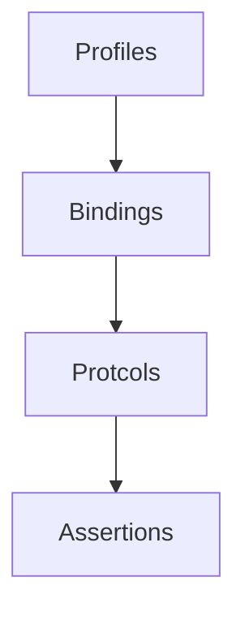
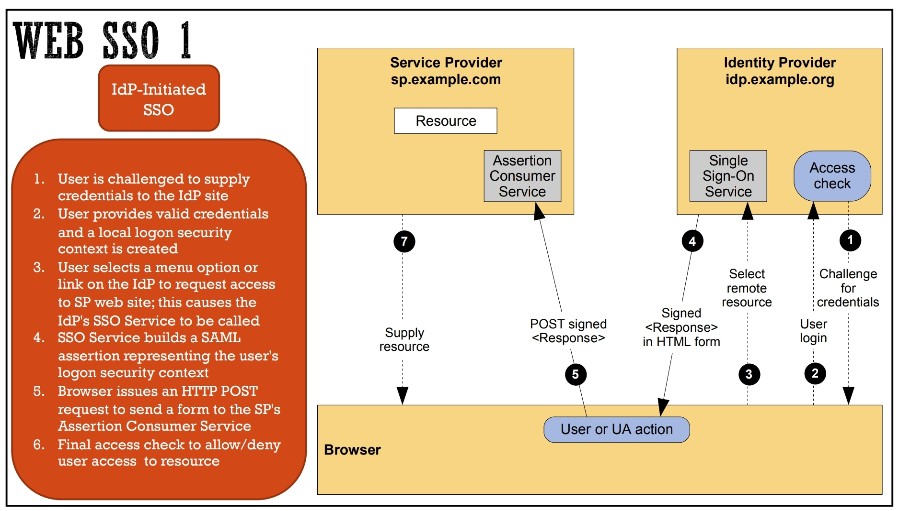

# Authentication

## User Authentication and Digital Identity

Identity is the set of attributes that define a person. Attributes is a characteristic or property that describe a state, an appearance, or other aspect.

Digital identity is the set of attributes that define a person in the digital world.

> More on cross-border digital identity: eIDAS

### Digital Identity Lifecycle

1. **Enrollment**: The process of creating a digital identity; also called **Identity Proofing**
   
   1. An individual is uniquely identified (ie. passport, driver's license) by _Personal Identifiable Information_ (Full Name, Date of Birth, Address, ...).
   2. Evidence is validated (check of information provided by the individual).
   3. Real world identity is mapped to a digital identity.

2. **Authentication**: the process of verifying the identity of a user.

3. **Authorization/Access Control**: The process of giving access to a resource based on the user's identity.

4. **Deregistration**: The process of removing a digital identity.

**Identity Assurance Levels** are a categorization of the level of confidence that an identity is valid. They are usually based on the level of evidence provided by the individual.

- **I**: lowest, for low risk tasks like newsletters or surveys;

- **II**: moderate, for online e-commerce or home banking;

- **III**: high, for trading applications and tax fillings;

- **IV**: highest, for military applications

## Passwords

When logging in to a system, the user is usually asked to provide a username and a password: the username is used to identify the user, while the password is used to authenticate the user. This is called **User Authentication**. Password should be secrets shared only by the user and the system.

Researchers focus on authentication process, practitioners aim to protect the user.

To strength the password, you can combine other techniques (ie. 2FA, biometrics).

### History

In the past, password were used on mainframes to protect the abuse of resources. In the seventies they were used to protect the access to personal computers; password were protected by **hashing** and **salting**. The Morris Worm was the first worm that exploited the use of weak passwords, exhausting resources. The **shadow files** which kept the password were only readable by root user, this being a form of _access control_.

With the expansion of the World Wide Web passwords were replaced by certificates based on public key cryptography. Not a good solution for the final user. Client then started to use username and password while servers used certificates.

After, reset of forgotten password was automated. Problem nowadays is that users tend to use the weak and same password everywhere. Phishing is also a problem.

### Attacks and Mitigations

Attacks on passwords are:

- **On-line**, which can be mitigated by reducing the number of attempts.

- **Off-line**, when the attacker steal the file containing the password. This can be mitigated by using a **hashing algorithm**.

**Brute Force** consist on trying all possible combinations of symbols. With cloud computing this has become easier and cheaper. An evolution of this attack are **dictionary attacks** and **Rainbow Tables** which are precomputed tables of hashes.

**Mitigations**:

- change default password

- avoid guessable passwords

- don't use common passwords

- don't use password hints

- limit number of attempts

### Password Managers

A password manager is a software that stores and manages passwords. It is a good idea to use a password manager, but it is important to use a strong master password.

## Protecting the password file

[7 Cryptography Concepts EVERY Developer Should Know by FIreship](https://www.youtube.com/watch?v=NuyzuNBFWxQ&ab_channel=Fireship)

### Hashing

cHashing is a one-way function that maps a string to a fixed-length value. It is used to protect passwords. The hash function is usually irreversible, but it is possible to find collisions.

- ease of computation

- compression

- one-way

- collision resistance

- strong - check for integrity of data, recalculating the hashand comparing with the given one

- weak - make difficult to generate an equal hash with a random input

changing even a single letter makes the hash change completely: this is called **avalanche effect**

> Example of hash function: MD5 (broken), SHA-256

> To protect a password file you generate a hash of the password and store it in the file, when the user logs in you hash the password and compare it with the one in the file

Common password hash are stored in dictionaries or rainbow tables, which makes them vulnerable to attacks.

### Salting

A salt is a random string that is added to the password before hashing it. This makes it harder to find collisions.

> Example: Unix uses a 12 bit salt

The **Work Factor** is the number of iterations of the hashing algorithm. The higher the work factor, the harder it is to find a collision. This makes computation more expensive. It is crucial to find a balance between security and performance. (ideally less than a second)

> Example: Argon2, bcrypt, scrypt

### Credential Stuffing

Hackers try cracked credentials on different online services. This is called **Credential Stuffing**. It is important to use a different password for each service.

## Phishing

Phishing tries to obtain sensitive information by impersonating as a trustworthy entity. It is a form of **social engineering**. Users should be trained to recognize phishing attempts.

## Extensions of Password Based Authentication

### Multi-Factor Authentication

It is a procedure based on _two or more_ factors to authenticate a user. It is a good idea to use 2FA, but it is important to use a strong second factor.

Types of MFA are:

- knowledge-based auth (password, security question)

- ownership/possession-based auth (token, smartcard, phone)

- inherence-based auth (biometrics)

- location-based auth

- time-based auth

#### One-Time Passwords

One time passwords are generated by a server and sent to the user. They are used to authenticate the user. They are usually generated by a **Time-based One-Time Password Algorithm** (TOTP) or a **HMAC-based One-Time Password Algorithm** (HOTP).

If the secret key is stolen, the attacker can generate new and valid TOTP values. TOTP is also vulnerable to:

- reply attacks

- MiM

- weak seed used in generation

- keyloggers and screen scraping

- social engineering

> Example: Lockheed Martin breach

#### PSD2

The **Payment Services Directive 2** (PSD2) is a European Union directive that requires banks to implement strong customer authentication (SCA) for online payments. The overall goal of PSD2 is to increase security and reduce fraud for online payments and to increase competition and innovation in the payments industry by allowing non-bank players to access customer account information.

#### Challenge-Response

Challenge-Response is a protocol that uses a challenge-response authentication. The server sends a challenge to the user, which it encrypt with the hash of the password. The response is then sent back to the server, which verifies it (the server also compute the encryption of the challenge).


#### Smartphones as MFA

Smartphones can be used as a second factor. You have the advantage of not having to carry a token. The problem is that the smartphone can be not always available.

#### Problems

MFA is still not secure enough.

> Example: MFA Fatigue Attack - the attacker floods the user with MFA requests, and a distracted user could grant access.

#### FIDO (not in the exam)

FIDO is a standard for authentication. It is based on the idea of using a **FIDO Authenticator** (a device that generates a cryptographic key) and a **FIDO Server** (a server that verifies the key).

## Outsourcing Authentication (delegare)

There were many attempts to outsource authentication. One example is _SPID_. Problem is to secure all phases of authentication. A solution is to use a Third Party Identity Provider (IdP).

## Single Sign-On (SSO)

Single Sign-On means outsourcing authentication to trusted 3rd party **Identity Providers**. The user is authenticated once and then the user is granted access to multiple services.

Basically:

1. The user wants to access an application

2. The service provider refer to the identity provider

3. IdP ask for credentials

4. User provide credentials to IdP

5. IdP authenticate the user

6. The service provider give the user an authentication token

**Properties**:

- credentials never leave the authentication domain (IdP + User Agent)

- service providers have to trust the authentication domain

- authentication transfer has to be secure

## SAML

SAML is a standard for exchanging authentication and authorization data between an identity provider and a service provider. SAML stands for Security Assertion Markup Language. It is heavily based on mechanism implemented in browsers (redirects, cookies, etc.). It is a XML-based protocol.

The SAML protocol consists of several components:

1. **Identity provider (IdP)**: The IdP is a system or service that is responsible for authenticating users and issuing security tokens.

2. **Service provider (SP)**: The SP is a system or service that requires authentication and authorization in order to provide access to resources.

3. **Assertions**: Assertions are security tokens that contain information about a user's identity and the permissions or privileges associated with that identity.

4. **Protocol binding**: Protocol binding specifies how SAML messages (e.g., assertions or requests) are exchanged between systems.

5. **Profile**: A profile is a set of rules and guidelines for using SAML in a specific context or scenario.

A **Federation** is a group of organizations or systems that have agreed to work together and share resources in a coordinated way. Federations are often formed to facilitate the exchange of information, resources, or services between the member organizations or systems.

> An agreement between two or more parties to share information and resources like an airplane company and a hotel company.

*The Schema (arrow means contains)*



### SAML Assertions

An assertion is a set of statements (claims) about a subject [ie. user].

- **Authentication Assertion**: who issued the assertion, when it was issued, who is the subject, how the subject was authenticated

- **Attribute Assertion**: details about the subject

- **Authorization Assertions**: what the subject is allowed to do

:exclamation: SAML doesn't provide the authentication: the statement refers to a prior authentication. It only "transport" the state

### SAML Protocol

The Security Assertion Markup Language (SAML) defines a set of protocols for exchanging authentication and authorization data between systems. SAML protocols **specify the rules and procedures for transmitting and processing SAML messages** (e.g., communication and cryptography), and are used to ensure that the messages can be properly interpreted by the systems involved in the exchange.

- SAML 2.0: enables SSO

- SAML 1.0: less used

- SAML-P: designed for healthcare.

### SAML Bindings

In the Security Assertion Markup Language (SAML), **bindings are the mechanisms by which SAML messages** (e.g., assertions or requests) **are exchanged between systems**. SAML bindings define how the messages are **transmitted and encoded**, and are used to ensure that the messages can be properly interpreted by the systems involved in the exchange.

> For example, in the web ecosystem we use **HTTP Redirect**: the assertion is sent as a query parameter in the URL. The assertion is signed using a query parameter. The assertion is encrypted using a query parameter.

### SAML Profiles

Are the composition of a set of bindings, protocols and assertions.

#### Web Browser SSO Profile

The user is redirected to the IdP, the IdP authenticates the user and redirects the user back to the SP with an assertion. The assertion is signed and encrypted. The assertion is sent using a POST request.

**IdP-initiated SSO** is useful when the user needs to access multiple SPs through a central portal. For example, a user may log into a corporate portal and then navigate to different internal apps such as HR, CRM, email, etc. without having to authenticate again.

**SP-initiated SSO** is useful in scenarios where a user may have direct access to different SPs and wants to authenticate once and then access all the resources to which they have access.




### Authentication Context

The authentication context is a set of attributes that describe how the user authenticated at an IP. It is used to define the **level of assurance** of the authentication.

### Metadata

- EntityID: the unique identifier of the entity

- Cryptographic keys: public keys used to verify signatures

- Protocol endpoints: the URL of the endpoints

### Security Considerations

The trust relationship between parties _should_ be established using a PKI.

When integrity and confidentiality are required, TLS is recommended. On delivery of the assertion, the assertion must be signed and encrypted.

Processes should always check expiration dates. Assertion should contain a unique ID to prevent replay attacks. An application should only accept assertions that are intended for it.

XML is vulnerable to XML attacks. (XXE)

User has the control over his identity. Privacy is guaranteed by pseudonyms, one-time ids, auth context (**more on Privacy and GDPR section**).

## Identity Infrastructures

### SPID (Sistema Pubblico di Identità Digitale)

SPID is the Italian national identity infrastructure. It is based on SAML 2.0 and is managed by AgID (Agenzia per l'Italia Digitale). It is based on the Web Browser SSO Profile.

The SPID register, maintained by AgID, contains the metadata of the IdPs and the SPs:

- SAML identifier

- name

- type (IdP or SP)

- URL of the metadata

- list of attributes

### CIE 3.0 (Carta d'Identità Elettronica)

CIE is the Italian national identity card. It is based on the Web Browser SSO Profile. It stores the following:

- Name

- Surname

- Place and Date of Birth

- Residency

- Holder's photo

- Two fingerprints

- Different Validity Periods

#### Capabilities

- NFC

- Cryptograhy

### eIDAS (Electronic Identification and Trust Services for Electronic Transactions in the European Union)

eIDAS is the European identity infrastructure. It is based on SAML 2.0 and is managed by the European Commission. It is based on the Web Browser SSO Profile.

Each EU country has to implement an eIDAS-node.

A vulnerability in the eIDAS-node was discovered in 2018. The vulnerability allowed an attacker to impersonate an IdP and to issue assertions to any SP.

An Digital Wallet is under discussion. It will be based on Decentralized Identifiers (DIDs) and Verifiable Credentials (VCs). A Framework (ESSIF) is under development.

# SAML Resources

*Authentication assertion*

```xml
<saml:Assertion>
    <saml:Issuer>https://idp.example.com</saml:Issuer>
    <saml:Subject>
        <saml:NameID>
            testid
        </saml:NameID>
    </saml:Subject>
    <saml:Conditions
    NotBefore="2010-01-01T00:00:00Z"
    NotOnOrAfter="2010-01-01T00:00:00Z">
    >
        <saml:AudienceRestriction>
            <saml:Audience>https://sp.example.com</saml:Audience>
        </saml:AudienceRestriction>
    </saml:Conditions>
    <saml:AuthnStatement>
        <saml:AuthnContext>
            <saml:AuthnContextClassRef>
                PasswordProtectedTransport
            </saml:AuthnContextClassRef>
        </saml:AuthnContext>
    </saml:AuthnStatement>
</saml:Assertion>
```

*Attribute assertion*

```xml
<saml:AttributeStatement>
    <saml:Attribute 
        Name="email" 
        NameFormat="urn:oasis:names:tc:SAML:2.0:attrname-format:basic">
        <saml:AttributeValue>
            test@test.com
        </saml:AttributeValue>
    </saml:Attribute>
    <saml:Attribute 
        Name="name" 
        NameFormat="urn:oasis:names:tc:SAML:2.0:attrname-format:basic">
        <saml:AttributeValue>
            Test
        </saml:AttributeValue>
    </saml:Attribute>
    <saml:Attribute 
        Name="CreditLimit" 
        NameFormat="urn:oasis:names:tc:SAML:2.0:attrname-format:basic">
        <saml:AttributeValue>
                1000
        </saml:AttributeValue>
    </saml:Attribute>
</saml:AttributeStatement>
```
