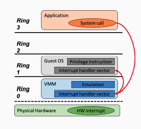
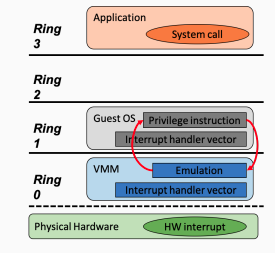
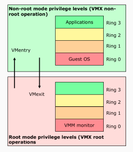
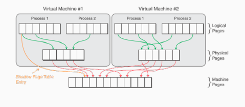
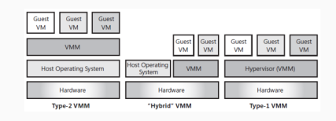
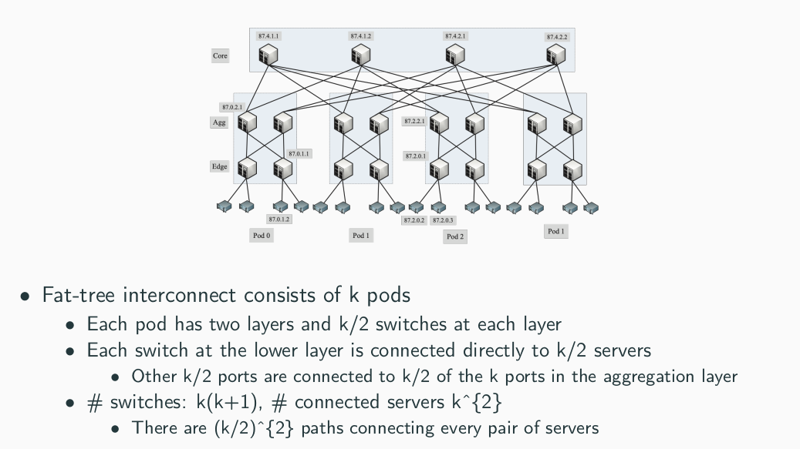
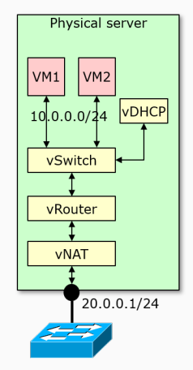
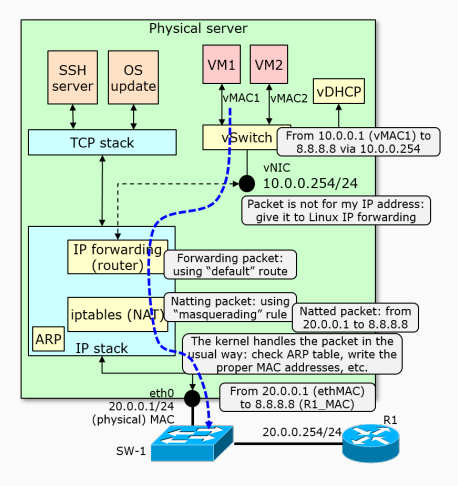
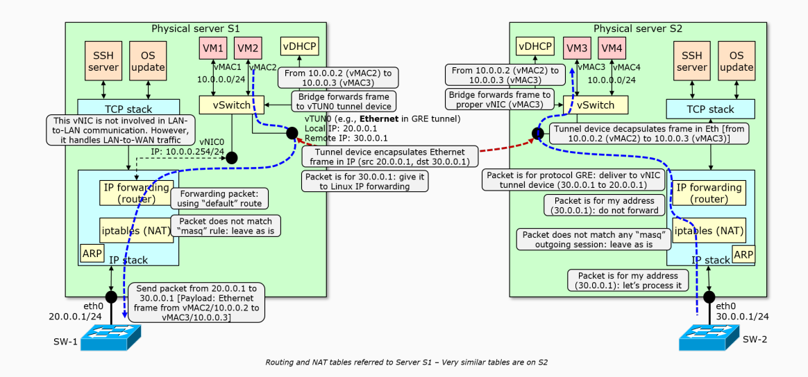
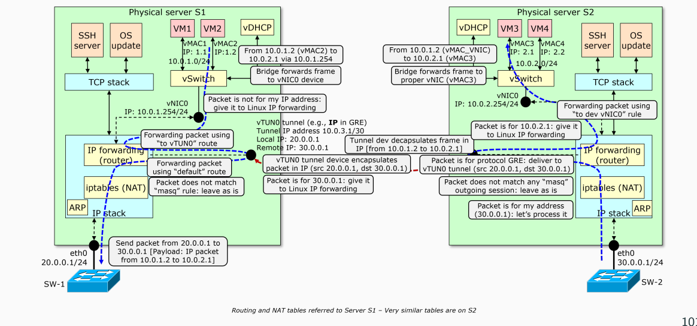

# Fog And Cloud

---

---

## Introduction

Fog and Cloud Computing make accessible your data anywhere anytime.
There are many challenges in the field of cloud computing: store, share, analyze, search, transfer, visualize, secure. We need to build distributed and scalable systems.

**Economies of scale**: cost are lower for big datacenters.

### Problems of a large scale distributed system

- procurement cycles
- deployment effort
- cost for power and cooling
- system administration
- low utilization
- disaster recovery

### From Innovation to Service

First of all a problem is solved through an **innovation** where you handle all.
The the innovation is translated into a **product** which can be bought.
The product transform in a **service**, usually with the _pay as you go_ model.

In case of cloud computing everything started with **virtualization**.

### Requirements

- Connectivity
- Interactivity (seamless interface)
- Reliability (users not affected by failures)
- Performance
- Pay as you go
- Programmability (easy development of complex services)
- Data Management (for large quantities)
- Efficiency (Cost and Power)
- Scalability and elasticity
- Security

You can think of cloud computing as _Internet computing_.

### Definition

> Cloud computing is a model for enabling ubiquitous, convenient,
> demand network access to a shared pool of configurable computing
> resources (e.g., networks, servers, storage, applications and services) that
> can be rapidly provisioned and released with minimal management effort
> or service provider interaction

### Key cloud concepts

- Shared resource pool
- Broad network access
- On-demand automated reservation
- Rapid Elasticity
- Pay by Use

### Fog Computing

We are moving from a cloud computing model to a _fog computing_ model. This means replication of the cloud computing model in a local area network.

Also called _edge computing_.

Advantages of fog are:

- Computing latency
- Bandwidth and costs
- Resource availability / ownership
- Data privacy

Managing all the resources is not easy. We need some kind of _orchestration_.

## Cloud Ecosystem

- Delivery model (SaaS, PaaS, ...)
- Infrastructure (distribution, virtualization, ...)
- Deployment models (public, private, hybrid)
- Attributes (access, elasticity, ...)
- Resources (storage, computing, ...)

### The NIST reference model

- **Carrier**: provides connectivity between service provider and consumer
- **Service Consumer**: who use services offered by the Service Provider
- **Service Provider**: it is responsible for providing the service
- **Broker**: manages use, performance and delivery of the services
- **Auditor**: third-party that checks the "quality" of the service

### Virtualization

It is at the base of the cloud computing model. It abstract computer resources, hiding physical hardware.

**Multi-tenancy**: multiple users can use the same instance of a software which run on a server. A tenant is a group of user who share common resources.

### Elasticity

Cloud need to be scalable to handle every load meaning being able to scale up and down.

The pay as you go model solves this problem because it reduce the risk of over-provisioning (under-utilization) and under-provisioning (saturation).
A cloud provider need to handle loads wasting less resources possible.

While if you buy a server you need to think about the maximum load, with the pay as you go you save money, particularly in heavy period of the year.

**transference of risk**: you transfer the rik not to be able to provision to the cloud provider. discharge of responsibility.

Obviously, it is not always the best option to move to the cloud, each case is different.

### Deployment Models

#### Public Cloud

For a general public, the service provider manages the infrastructure, lot of customers use the same cloud, easy elasticity.

#### Private Cloud

Exclusive use of an organization, management handled by their own, local o third-party resources.

#### Community Cloud

Composed by one or more organizations which share resources, management handled by the community o third-party, location on-premises or off-premises.

#### Hybrid Cloud

A combination of public and private cloud.

### Delivery Models

#### Software as a Service (SaaS)

It just runs a single piece of software. Made for an end-user.

Examples are CRM, financing software, accounting software, communications, workflow management.

#### Platform as a Service (PaaS)

It gives and API and ake care of the deployment. Made for an Application developer.

Example is Google App Engine.

#### Infrastructure as a Service (IaaS)

It provides the bare metal infrastructure. Made for a System Admin.

Examples are server hosting, load balancing, virtual instances, storage.

#### Other Models

Other models can be Database as a Service, or X as a Service.

#### Responsibility

For a user point SaaS stops at the Interface level, PaaS at the Application (API) level while IaaS at the OS level. Things like Hypervisor, Storage, Network Computing are handled by the cloud provider.

### The Cloud Ecosystem

#### AWS example

Its infrastructure consist of compute and storage server interconnected by high speed network. Amazon offer lots of regions.

An instance of AWS is a virtual machine with some specified resources. User choose region and availability zone and the type of instance.

Each instance has a private IP address (internal EC2 communication) and a public IP address. (external communication).

Some of the services are:

- Elastic Compute Cloud (EC2)
- Simple Queue Service (SQS) [communication between EC2]
- Simple Storage Service (S3) [large objects], Simple DB, Elastic Block Storage (EBS) [block level storage]
- Cloud Watch
- Auto Scaling

## Cloud Virtualization

Before virtualization, each application was deployed on a single physical machine. But they had high cost and usually under-utilized.

### Advantages

- **Isolation**: critical applications can run in different and isolated environments.
- **Consolidation**: optimization of hardware resources running multiple app on one physical macchine.
- Optimization of **energy consumption**.
- **Flexibility** and **Agility**: complete control of the virtual machine.
- **Scalability**: through duplication.
- **Disaster recovery**: through failover.
- **Rapid deployment**: of new servers (instances)

### Limitations

- **Additional overhead**: because an entire OS
- **Difficult to handle different hardware**

### Usage Scenarios

- Server virtualization
- Workstation/Desktop virtualization

### Common Off The Shelf (COTS) Hardware

COTS hardware is hardware that is not designed for cloud computing. You can use traditional hardware with discount on quantity.

### Layering

- Hardware
- Software
  - Operating System
  - Libraries
  - Applications
    - use libraries functions
    - make system calls
    - executes machine instructions

#### Interfaces

- ISA (Instruction Set Architecture): between the hardware and the OS
- ABI (Application Binary Interface): between the OS and the application
- API (Application Program Interface): between the application and the user

### VM, Host OS, Guest OS

A **Virtual Machine** is a software which emulates a physical machine. it can execute OS + applications.

**Host OS** is the OS running on the physical machine.

**Guest OS** is the OS running on the virtual machine.

### Hypervisor (or Virtual Machine Monitor VMM)

It is the software in charge of the virtualization process. It virtualize CPU, Memory and other cards (NIC).

The Hypervisor is usually a stripped down version of the OS running on the physical machine. It exports standard devices to the upper layer OS. Because is stripped down is more secure.

### CPU Virtualization

The VM assigns one or more CPUs to the guest OS.

in case of different architectures you need to "emulate" the ISA (slow) or some machines can support seamless emulation.

A VMM needs to satisfy:

- It exports execution environments, identical to a real machine
- It efficiently executes the virtualized system.
- The VMM should have the complete control of real system resources.

#### Hardware Privileges

Usually with 4 (**user space** and **kernel space**) rings in onion shape.

Virtualization uses **ring de-privileging**, which runs al guest software at privilege level grater than zero.

- 0/1/3 model: memory access is granted to the guest OS, possible conflicts with VMM.
- 0/3/3 model: guest OS is at the Application Level, no more protected.

**Privileged instruction**: a CPU instruction that needs to be executed in a privileged hardware context. It generates a **trap**. es: HALT, I/O

**Sensitive instruction**: expose CPU physical state, to be virtualized they must be privileged.

**Trap**: an interrupt that is generated by the CPU. It execute operations at kernel level. It can be an **exception**, a **system call** or a **hardware interrupt**

**Traditional OS**:

> CPU traps to an interrupt handler vector in OS, CPU then switch to kernel mode and execute OS instructions.

**Trap & Emulate paradigm**

> Guest OS is executed in an unprivileged mode, the trap is than intercepted by the VMM which emulates the effect of the privileged instruction.

> _trap origin_ -> _handler_
>
> application -> guest OS
>
> guest OS -> VMM

- System Calls:
  - CPU traps
  - VMM jump to the guest OS
  - 
- Privileged Instructions:
  - Trap to be emulated by VMM
  - VMM jump to the guest OS
  - 
- Hardware Interrupts:
  - Trap to be handled by VMM
  - VMM jump to the guest OS
  - 

**Conclusions (x86)**:

1. Several sensitive instructions are not detectable by the VMM.
2. The VMM cannot correctly emulate the behavior of privileged instructions.

_Solutions_:

1. Parse the instruction and check if it is privileged (Interpretation / Binary Translation).
2. Change the guest OS (paravirtualisation).
3. Make all sensitive instructions privileged (HW supported virtualization).

#### Types of Virtualization (x86)

##### Full Virtualisation (Dynamic Binary Translation)

When the Guest OS can run unmodified in the hypervisor

- translation on the fly
- VMM translate binaries not source code
- no specific hardware nor OS modifications
- big overhead
- es. Vmware workstation

##### Paravirtualisation

The Guest OS need to be modified in order to be executed. It knows it is running in a virtualized environment.

- System calls are replaced by a call to the VMM (hypercall)
- non-virtualizable instructions are replaced by a call to the VMM (hypercall)
- ABI don't change
- Guest OS is deprivileged (ring 1)
- no emulation or dynamic translation. Patch ahead of time.
- Simpler implementation, require a modded OS

##### Hardware Assisted Virtualisation

Hypervisors exploit hardware features now included in CPU. The idea is to avoid sensitive instructions.

- Processor run in a new mode **Virtual Machine eXtensions**
  - Root mode (VMM runs here)
  - Non-Root mode (Guest OS runs here)
- basically two context:
  - guest OS and Apps
  - VMM monitor

**VM entry**: VMM to guest;
**VM exit**: guest to VMM

The **Virtual Machine Control Structure (VCMS)** saves the state between context switches

### Memory Virtualization

Modern OS uses "memory paging". Each OS has a set of tables to translate virtual addresses to physical addresses. Job done by **Memory Management Unit**.

**Advantages of Virtual Memory** are Simplicity, Isolation and Optimization

Normally you would need an extra level of translation when virtualizing memory:

1. Guest Virtual/Logical Address
2. Guest Physical Address
3. Machine Physical Address

To avoid this, the **Shadow Page Table** is introduced and its like a shortcut.

- Physical to Machine is maintained by the VMM.
- Logical to Machine is stored by VMM in shadow page table exposed to HW.
- The most used Logical to Machine are put in the Shadow Page Table.

**Extended Page Table/Rapid Virtualization Indexing**: the VMM can translate virtual addresses to physical addresses in two jumps using hardware. Using bigger page tables help. Need a good TLB cache guarded by IDs.

### I/O Virtualization

#### Device Emulation

The device iss implemented by software but the Guest OS doesn't know. The VMM remaps communications to the physical hardware.

- simple to set up
- slower and increased CPU load

#### Para-virtualized Device

Guest OS has dedicated drivers for the devices. The OS is modded with external modules to make it work. Usually for Network Cards, Disks, GPU.

**Memory Ballooning**: normally the VMM assign a static amount of memory. But with this technique the Hypervisor knows how much memory Guest occupies and update the allocation.

#### Direct Assignment

VMs can also comunicate directly with physical hardware, which is assigned exclusively to a single VM. It is complicated though.

#### IOMMU (Input/Output Memory Management Unit)

It is an extension of the CPU. It is a hardware that can translate device addresses to physical addresses.

The PCI-e standard define its mechanism: SR-IOV (Single Root IO Virtualization). The VM gets a set of functions and the physical component multiplex between the requests.

### Hypervisor Architectures

Guarantee _performance_ and _easiness of deployment and utilization_.

#### Type 1

The hypervisor runs directly on bare metal. Best performances, but problems with drivers.

> es. VMware ESXi, Microsoft Hyper-V

#### Type 2

The hypervisor runs on a Host OS as an application. Simpler but less performant of type-1.

> es. VirtualBox

#### Hybrid Approach

Host OS and Hypervisor are side by side. Good of both worlds.

> es. KVM

### OS Level Virtualization

#### PROS and CONS of Full Virtualization

| PROS                                  | CONS                             |
| ------------------------------------- | -------------------------------- |
| Compatible with existing Applications | Big Overhead                     |
| Support different OS                  | Difficult to set up and maintain |
| Excellent Isolation                   | Booting Times                    |

#### Lightweight Virtualization

When to use lightweight virtualization:

- no need for classical vm
- overhead not acceptable
- need quick isolated environment
- need to scale horizontally and vertically

In case of OS-level virtualization, the OS (Linux) is the hypervisor itself.

**Requirements:**

- Fine-grained control over the virtualization environment
- security and isolation
- manage entire datacenters with utilities

#### cgroups and namespaces

Originally designed to isolate processes and threads. You can control Hardware quotas (CPU, Disks, Memory), Network quotas and privileges.

**cgroups features**:

- resource limiting
- prioritization
- accounting
- control

**namespaces**: each process can access resources inside its own namespace.

For example _PID namespace_ allow a process to create a new tree with its own PID 1 process.

Or _Network namespaces_ allow to have like a "virtual network" for a process. (veth0)

_Mount_ for a complete file system, _UTS_ isolation of hostname and NIS domain, _User_ for root privileges.

#### Linux Containers (LXC)

With containers you don't have to install a new OS. You use the kernel of the Host OS. inside they see like a VM. Outside they look like processes.

They do not emulate hardware, run different OSs and security is hard.

They are faster to set up and to run and lighter than VMs.

LXC are basically cgroups and namespaces plus other stuff.

LXC are sort of modular to implement isolation or security.

Portability not granted.

#### Docker

Docker focuses on applications simplifying the deployment and execution creating a lightweight, portable, self-contained package that runs everywhere.

"_If an app works locally it works on the server_"

Some of additional features:

- portability
- automatic build
- versioning
- better ecosystem
- integrations

**Docker Image**: immutable template, can be in registries, `registry/user/image:tag`.

**Docker Container**: an instance of an image, maintain changes.

Common options are to expose a TCP/UDP port of the container to the host and mount a folder on the host.

Docker has an internal private network (bridge docker0).

_Libnetwork_ is a library to implement network isolation and implements teh Container Network Model. (IP management)

**Union File System**: it gives a single coherent and unified view to files and directories of separate file-system. In other words, it mounts multiple
directories to a single root.

When you want to to upgrade a container, it only upgrade the modified files.

A Docker container can be built by a composition of layers.

Automatic build is implemented by a **Dockerfile**.

**Advantages**: Continuous Delivery, Improved Security, Run Anything, Reproducibility, Kubernetes.

**Docker Compose**: tool for defining and running multi-container Docker applications.

## Cloud Networking

### Data Center Networks

There are 4 categories of cloud workload:

- CPU-intensive
- Memory-intensive
- I/O-intensive
- Storage-intensive

3 types of relation:

- Peering: exchange between two networks freely - TIer 1
- Transit: network pays to access Internet - Tier 2
- Customer: customer pays to access Internet - Tier 3

Always in search oof best performance for new use-cases (es. video streaming)
Usually "last mile" is the bottleneck.

Regional Access provider are less common now, CDNs in Global Internet Core.

A datacenter Network:

- has huge scale
- has high bandwidth
- low RTT
- regular and planned topology

You have to have **full control** of the environment.

Architecture is established by asking:

- expect lots of small packets or few large packets?
- provide a single service or a set?
- communication is internal or external
- how much workload I expect?

#### Concepts

- A network consists of a set of **nodes** and a set of **links** (communication channels).
- Interconnection network can be **blocking** or **non-blocking**.
- **Switches** and communication channels are the elements of the interconnection fabric.
- **Degree of node** is the number of link connected to.
- **Nodes** are the machines
- **Network Interface** provide connection to the network.
- Interconnection network are distinguished by:
  - Topology
    - It determines the **network diameter** - average distance between nodes
    - **bisection width** - minimum number of links to delete to divide in half the network
    - **Static** networks (direct connection) or **Switched** networks (use switches)
  - Routing
  - Flow Control

**hierarchical** topology:

1. Core switches [_expensive_]
2. Aggregation switches
3. TOR (Top of the Rack) switches
4. Servers

**Costs**:

- 45% servers
- 25% power infrastructure
- 15% network infrastructure
- 15% power draw

#### Topology of a Datacenter (Folded Clos topology _or_ Fat Trees)

_Butterfly Network_ ➡️ _Clos (2 BF)_ ➡️ _Folded Clos_

Design principles:

- network should scale to very large number of nodes
- multiple core switches
- multi-path routing (Equal Cost Multi-Path Routing)

#### Unsolved Problems

TCP is too slow to be used in datacenter. POssible collisions in data path.

- **Low Latency**
- **High Throughput**
- **High Burst Tolerance**

### Networking in virtualized environments

Usually there is a **software bridge** that connects VMs.
**Challenges** are to provide communication with the external world and to manage communication within the same server.
So we need to provide Ethernet (L2) connectivity to VMs/containers and provide IP connectivity to the outside world.

There are although 3 solutions:

1. Virtual switch in the host OS/Hypervisor
   - _Host Based switching_ has the best inter-VM traffic, policies, but additional overhead anc configuration
2. Use the NIC (virtual queues)
   - _NIC switching_ is an intermediate solution, managed by the network infrastructure not the OS
3. External switch (requires external support)
   - _Hairpin switching_ goes up to the physical external switch [no more used]

Today **Smart NIC** are introduced, and they have a processor just for switching so that CPU is used fr actual processing.

### Software Bridges in Linux

Linux allows to create bridge across the interfaces and exposing one unique virtual interface valid for the entire host.
(promiscuous mode)

Three main types of software switches:

- **Linuxbridge**
- **macvlan** (if you just have to provide connection to the external network)
  - VLAN like
  - each VM has its own macvlan interface with a unique MAC address.
  - 4 modes
    - _Private_: no direct connection between VMs, through the router
    - _Virtual Ethernet Port Aggregator_, through the L2 switch
    - _Bridge_: allow direct connection between VMs
    - _Pass-through_: MAC filtering not in use, through vNIC
- **Open vSwitch**
  - software implementation of a virtual multilayer network switch

### Complexity on a Single Server

**Problems:**

1. Who provides IPs?
   1. Use **direct routing**: bridged or routed. They are the same addresses of the physical network.
   2. Use **private addresses** and connect to Internet through **NAT**
2. May require more network services
   1. 
   2. _vNAT, vRouter, vSwitch, vDHCP_
3. Network isolation
   1. Usually achieved by using multiple vSwitches and vRouters inside the same physical server.
4. Tenants custom policies
   1. An Application Level firewall (L7) is used.
5. Server's TCP/IP need to coexist
   1. Necessity to distinguish inbound traffic towards VMs from the one directed to Linux.
   2. 

### Datacenters-wide Networking

Problems are the same.

#### L3 connecctivity

To provide L2 access to tenants, **tunnels** are used (GRE protocol). They want their VMs like connected by a switch, even if in different racks.

vLAN could be used but they are more complex to manage and less scalable.

#### L3 connectivity

**Kubernetes are used**: **tunnelling** and **direct routing**

#### Conclusions

- When the packet is in the _VM_ you only know the **IP routing table / ARP table of the VM**.
- When the frame is on the _bridge_ you only know the **filtering database**.
- When the packet is in the _Linux Forwarding module_ you only know the **IP routing table / ARP table of the host**

Other options are for example the **VxLAN technology** (full mesh solution, UDP encapsulation)

Preferable solution is using the **overlay model** (create a virtual topology rather than a physical topology)
