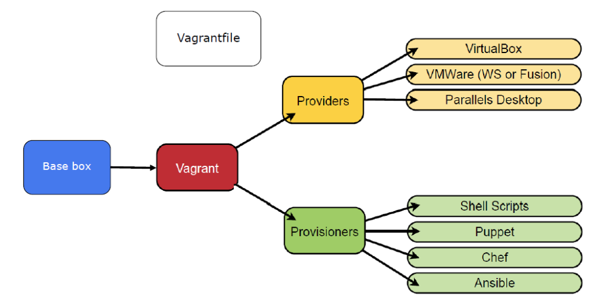
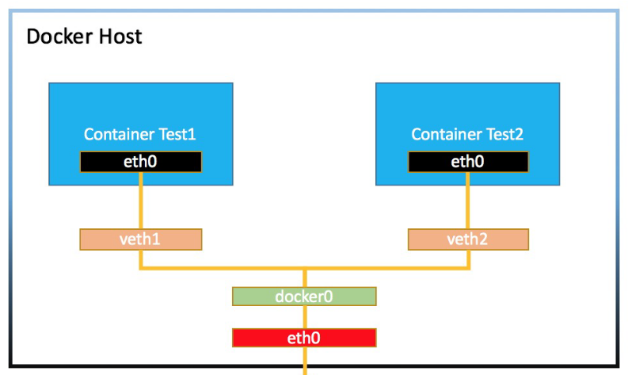
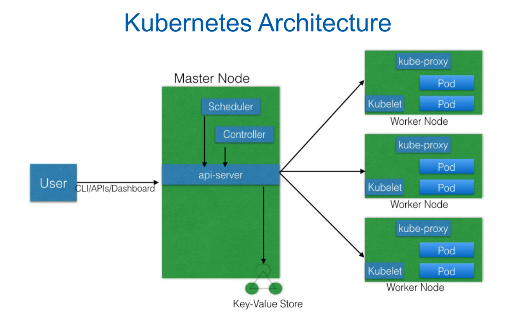
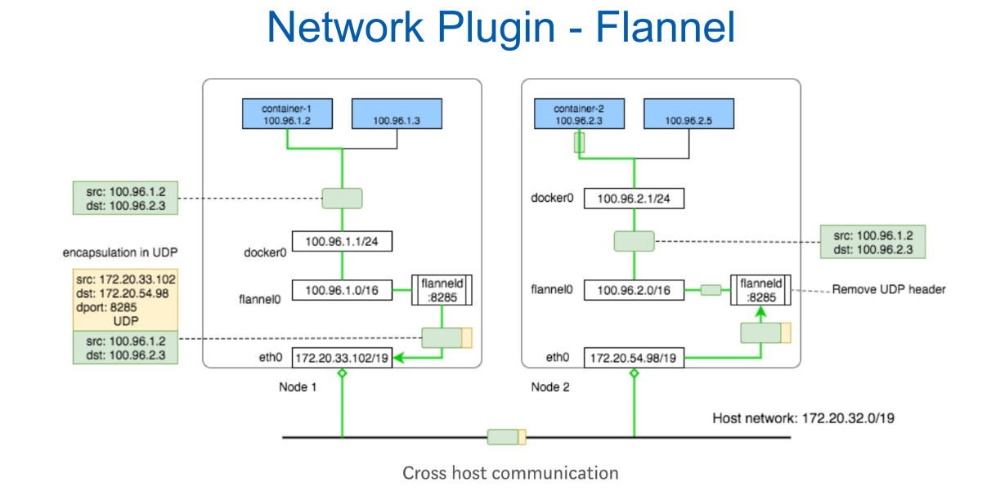
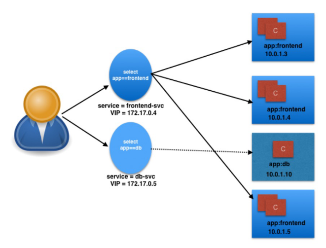

# Fog And CLoud Labs notes

## Vagrant



> HashiCorp Vagrant provides the same, easy workflow regardless of your role as a developer, operator, or designer. It leverages a declarative configuration file which describes all your software requirements, packages, operating system configuration, users, and more.

## Azure VM

We connect via an SSH Socks Tunnel

```bash
ssh -D 4444 -p AZURE_PORT disi@AZURE_URL
```

You can then add a provision script to be ran after the first startup of the machine.

```bash
sudo apt update && sudo apt upgrade && sudo apt install figlet && echo figlet FCC Course >> /home/vagrant/.bashrc
```

-_aggiorna Linux, installa figlet e mostra FCC Course quando si avvia una shell_

## Ansible

To manage multiple machines with consistency. It uses Infrastructure as a Code to define configurations readable by humans.

- **Playbook**: where all the scripts are kept
- **Inventory**: keeps track of all the machines to manage

## Containers

Containers are an application-centric way to deliver high-performing, scalable applications on the infrastructure of your choice. They are lightweight.

Advantages:

- Agile application creation and deployment
- Continuous development, integration, and deployment
- Dev and Ops separation of concerns
- Observability
- Environmental consistency across development, testing, and production
- Cloud and OS distribution portability
- Application-centric management
- Loosely coupled, distributed, elastic, liberated micro-services
- Resource utilization

Disadvantages:

- less secure ➡️ solution: Kata Containers

## 🐋 Docker

OS level virtualization, based on Linux kernel features (cgroups and namespaces), layered file system.

- **Docker Images** are read only templates for creating Docker Containers.
- **Docker Containers** are a runnable instance of an Image, state is not persistent.
- **Docker Daemon** is the process which manages containers
- **Docker Host** where the daemon runs.
- **Docker Client** to interact with containers
- **Docker Registry** is an image repository
- **Docker Compose** help to deploy multi-container apps
- **Docker Swarm** is a resource orchestrator

_Docker commands_:

```bash
docker create <image>
docker start/kill/rm <containerid>
docker run <image>
docker ps # list containers
docker images # list images
docker inspect <containerId> | jq -C .[] | less –RN # container information
docker stats/events/logs

# flags in run
-it # interactive -> apre la shell di un container
-d # detached mode -> rimane attivo anche chiudendo la tua shell
```

## Nested VM

```bash
# map my localhost:4444 to the Azure localhost:4444
ssh –L 4444:localhost:4444 –p Azure_PORT disi@Azure_URL

# (in Azure) expose 4444
vagrant ssh -- -D 4444
```

## Cloud Native

Cloud native is about patterns to build software that scale on elastic infrastructure in fast way.

## Twelve Factors

1. One codebase tracked in revision control, many deploys
2. Explicitly declare and isolate dependencies
3. Store config in the environment

## Docker Networking



3 options:

1. (Deprecated) link
2. Bridge Network for host in the same network
3. Overlay network for containers in different hosts

## Docker Volumes

To store data between containers.

```bash
# Mounting a host directory into a container
docker run -v <host path>:<container path> <image>

# Creating a volume and sharing it
docker volume create my_vol
docker run -v my_vol:/data <image>
```

## Open Stack (IaaS)

Open source software for creating private and public clouds. OpenStack software controls large pools of compute, storage, and networking resources throughout a datacenter, managed through a dashboard or via the OpenStack API. OpenStack works with popular enterprise and open source technologies making it ideal for heterogeneous infrastructure.

- Identity Management: Keystone
- Dashboard: Horizon + CLI
- Compute Service: Nova
  - Flavors 👉 hw macchine
  - SSH Access
  - Cloud Init 👉 initial scripts
  - Security Groups
- Networking Service: Neutron
- Image Service: Glance
- Block Storage Service: Cinder
- Object Storage Service: Swift

## Pets And Cattle

You can decide to solve problems or destroy an recreate a new thing in cloud.

## Container Orchestration

In a **production environment** our application need to:

- be fault-tolerant
- scale
- optimize resources
- comunicate with other applications
- be accessible from the outside world
- update or rollback with no downtime**production environment**

Container Orchestrators groups containers in clusters to reach these objectives.

## Kubernetes (k8s)

It is the most popular container orchestrator. It automate deployment, scaling, and management of containerized applications.



The **Master Node** is the entry point for the cluster, using API or CLI. It is responsible for managing the cluster and its resources. It keeps track of the cluster state in a key-value pair store (_etcd_) and can run in High Availability (more master, one final decision).

A **Worker Node** is a single physical machine where you can run Pods. The _kublet_ manages the worker node and ensure the containers are running.

We use the **kubectl** CLI to manage the cluster using a `.yml` file.

```yml
kind: Pod
apiVersion: v1
metadata:
  name: clock
  namespace: default
spec:
  containers:
    - name: clock
      image: ubuntu
      command: ["/bin/bash", "-c", "while true; do date; sleep 1; done"]
      volumeMounts:
        - name: clock-volume
          mountPath: /tmp/clock
```

A **Pod** is the simplest unit of a containerized application. It represent a single application (microservice).

- Are scheduled together on the same host
- Share the same network namespace
- Mount the same external storage (Volumes)

They are ephemeral containers, they are not persistent.

A **Replica Set** is a part of the Master Node Controller Manager, it keeps the specified amount of Pods running.

**Deployments** provide declarative updates to Pods and Replica Sets. While A Replica set is running, it creates a new one (B) with the updates specified in the deployment. Once B is up and running, it stops the old A. In case of problems with the deployment it rolls back to the previous version.

## Networking in Kubernetes

You need to assign an IP for each Pod, containers and Pods can comunicate with each other and might be exposed to the outside world. All of this is managed by the **Container Network Interface** (CNI). Inside the same Pod, containers shares the same network namespace (you can use localhost). In Pod-to-Pod communication the is no NATting. Flannel Overlay Network is used (UDP).



## External World Communication

**kube-proxy** can be used to expose applications outside the cluster, however **Services** are used: they are an HighLevel Abstraction which groups Pods and add policies.



## Namespaces

To partition cluster in "sub-clusters": kube-system (k8s) and default (user)

## ConfigMaps and Secrets

For runtime configurations and credentials.

## Storage in Kubernetes

Kubernetes uses a **Persistent Volume** to store data. It is contained in a Pod.

Volume types:

- emptyDir 👉 strictly connected to the Pod
- hostPath 👉 on the host
- gcePersistentDisk 👉 Google Compute Engine
- awsElasticBlockStore 👉 Amazon Elastic Block Store
- nfs 👉 Network File System
- iscsi
- secret

A **Persistent Volume Claim (PVC)** is a request for a Persistent Volume. It is created by the User and is used by the Kubernetes controller to create a Persistent Volume.

## Helm

**Helm** is a package manager for Kubernetes. It is a tool to manage Kubernetes applications.

## Ingress

**Ingress** is another way to expose services to the outside world. You do not connect directly to the service, but through the Ingress which has a Layer 7 HTTP load balancer.

## Kubernetes Scheduler 👉 FogAtlas

The scheduler decide where to place the Pods.

```yml
apiVersion: apps/v1
kind: Deployment
metadata:
  name: lb-example-edge
  namespace: default
  labels:
    app: lb-example-edge
spec:
  replicas: 1
  selector:
    matchLabels:
      app: lb-example-edge
  template:
    metadata:
      labels:
        app: lb-example-edge
    spec:
      nodeSelector:
        region: "EDGE"
      containers:
      - name: worker
        image: python:3.6-alpine
        command:
        - "/bin/sh"
        - "-ecx"
        - |
          echo "I am pod: $MY_POD_NAME runing on node: $MY_NODE_NAME" | tee index.html
          python -m http.server 8000 2>&1
        env:
        - name: MY_NODE_NAME
          valueFrom:
            fieldRef:
              fieldPath: spec.nodeName
        - name: MY_POD_NAME
          valueFrom:
            fieldRef:
              fieldPath: metadata.name
---
apiVersion: v1
kind: Service
metadata:
  name: "lb-example-edge"
  annotations:
    # Create endpoints also if the related pod isn't ready
    service.alpha.kubernetes.io/tolerate-unready-endpoints: "true"
spec:
  type: NodePort
  ports:
  - port: 8000
    nodePort: 30001
    targetPort: 8000
  selector:
    app: lb-example-edge
```
