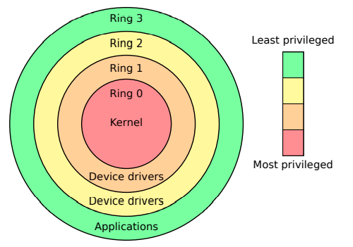
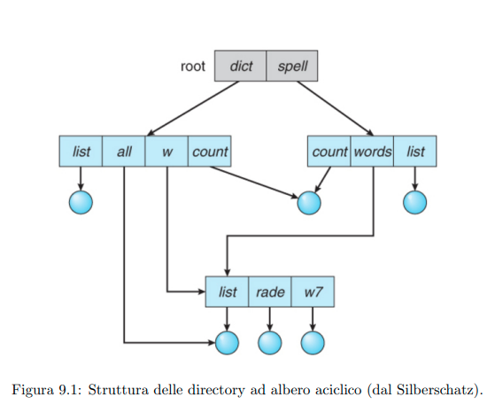
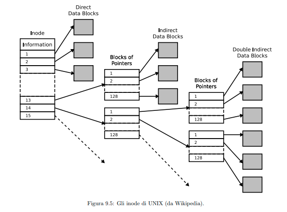

<script type="text/javascript" src="https://cdnjs.cloudflare.com/ajax/libs/mathjax/2.7.0/MathJax.js?config=TeX-AMS_CHTML"></script>
<script type="text/x-mathjax-config">
  MathJax.Hub.Config({
    tex2jax: {
      inlineMath: [ ['$','$'], ["\\(","\\)"] ],
      processEscapes: true
    }
  });
</script>

# Sistemi Operativi

- [Sistemi Operativi](#sistemi-operativi)
- [Storia](#storia)
- [Struttura Hardware](#struttura-hardware)
  - [CPU](#cpu)
    - [Registri](#registri)
    - [Accesso Memoria e I/O](#accesso-memoria-e-io)
    - [MMU (Memory Management Unit)](#mmu-memory-management-unit)
    - [Modalità di esecuzione](#modalità-di-esecuzione)
    - [Altro](#altro)
    - [RAM - Memoria Principale](#ram---memoria-principale)
    - [Comunicazione con il processore](#comunicazione-con-il-processore)
  - [DMA (Direct Memory Access)](#dma-direct-memory-access)
- [Funzioni di un Sistema Operativo Moderno](#funzioni-di-un-sistema-operativo-moderno)
  - [Gestione della memoria principale](#gestione-della-memoria-principale)
  - [Gestione della memoria secondaria](#gestione-della-memoria-secondaria)
  - [Gestione I/O](#gestione-io)
  - [Gestione dei File](#gestione-dei-file)
  - [Protezione](#protezione)
  - [Sistemi Distribuiti](#sistemi-distribuiti)
  - [Tipi di Sistemi Operativi](#tipi-di-sistemi-operativi)
- [Architettura](#architettura)
  - [Principi di progettazione](#principi-di-progettazione)
    - [Requisiti](#requisiti)
    - [Policy e meccanismi](#policy-e-meccanismi)
    - [Realizzazione pratica](#realizzazione-pratica)
  - [Struttura dei sistemi operativi](#struttura-dei-sistemi-operativi)
    - [Strutture monolitiche (in origine)](#strutture-monolitiche-in-origine)
    - [Strutture a strati](#strutture-a-strati)
    - [Strutture a microkernel](#strutture-a-microkernel)
    - [Sistemi a moduli](#sistemi-a-moduli)
  - [Macchine Virtuali](#macchine-virtuali)
    - [Simulazione dell'hardware](#simulazione-dellhardware)
    - [Tipi di macchine virtuali](#tipi-di-macchine-virtuali)
- [Processi e Thread](#processi-e-thread)
  - [Definizione](#definizione)
  - [Le informazioni di stato di un processo](#le-informazioni-di-stato-di-un-processo)
    - [Il Process Control Block (PCB)](#il-process-control-block-pcb)
  - [Lo scheduling](#lo-scheduling)
    - [Lo scheduler](#lo-scheduler)
  - [Operazioni sui processi](#operazioni-sui-processi)
    - [Terminazione di un processo](#terminazione-di-un-processo)
  - [Thread](#thread)
    - [Vantaggi](#vantaggi)
    - [Tipi di Thread](#tipi-di-thread)
  - [Comunicazione fra processi](#comunicazione-fra-processi)
    - [Memoria condivisa](#memoria-condivisa)
    - [Passaggio di messaggi](#passaggio-di-messaggi)
    - [Esempi di passaggio di messaggi](#esempi-di-passaggio-di-messaggi)
- [Scheduling](#scheduling)
  - [Lo scheduling a prelazione (preemptive)](#lo-scheduling-a-prelazione-preemptive)
    - [Criteri dello scheduling](#criteri-dello-scheduling)
  - [Algoritmi di Scheduling](#algoritmi-di-scheduling)
    - [First Come First Served (FCFS)](#first-come-first-served-fcfs)
    - [Shortest Job First (SJF)](#shortest-job-first-sjf)
    - [Scheduling a Priorità](#scheduling-a-priorità)
    - [Round Robin](#round-robin)
    - [Code Multi Livello](#code-multi-livello)
    - [Processi e Applicazioni](#processi-e-applicazioni)
- [Sincronizzazione fra Processi](#sincronizzazione-fra-processi)
  - [La Regione Critica](#la-regione-critica)
    - [Soluzioni Software](#soluzioni-software)
    - [Soluzioni Hardware](#soluzioni-hardware)
  - [Semafori](#semafori)
    - [Rischi nell'uso dei semafori](#rischi-nelluso-dei-semafori)
  - [Altre primitive di sincronizzazione](#altre-primitive-di-sincronizzazione)
    - [Monitor (concept)](#monitor-concept)
    - [`synchronized` in Java](#synchronized-in-java)
    - [Analisi e Prevenzione dei Deadlock](#analisi-e-prevenzione-dei-deadlock)
  - [Prevenzione dei Deadlock](#prevenzione-dei-deadlock)
    - [Prevenzione dinamica (complesso)](#prevenzione-dinamica-complesso)
- [Gestione della Memoria](#gestione-della-memoria)
  - [Indirizzamento e Binding](#indirizzamento-e-binding)
  - [Allocazione continua](#allocazione-continua)
    - [Partizioni fisse](#partizioni-fisse)
    - [Partizioni variabili](#partizioni-variabili)
    - [Compattamento](#compattamento)
    - [Il Buddy System](#il-buddy-system)
  - [Paginazione](#paginazione)
    - [Protezione e Condivisione](#protezione-e-condivisione)
    - [Dimensione dello spazio di indirizzamento: Page Table multi-livello](#dimensione-dello-spazio-di-indirizzamento-page-table-multi-livello)
    - [Page Table invertita](#page-table-invertita)
  - [Segmentazione](#segmentazione)
  - [Memoria virtuale](#memoria-virtuale)
    - [Paginazione su richiesta](#paginazione-su-richiesta)
    - [Sostituzione delle pagine](#sostituzione-delle-pagine)
    - [Allocazione dei frame ai processi](#allocazione-dei-frame-ai-processi)
- [File System e Memorie di Massa](#file-system-e-memorie-di-massa)
  - [Interfaccia del File System](#interfaccia-del-file-system)
    - [File](#file)
    - [Directory](#directory)
  - [Realizzazione](#realizzazione)
    - [Strutture dati](#strutture-dati)
      - [Disco](#disco)
      - [Memoria](#memoria)
    - [Allocazione dello spazio su disco](#allocazione-dello-spazio-su-disco)
      - [Allocazione contigua](#allocazione-contigua)
      - [Allocazione a lista](#allocazione-a-lista)
      - [File Allocation Table](#file-allocation-table)
      - [Allocazione indicizzata](#allocazione-indicizzata)
      - [_inode_ in UNIX](#inode-in-unix)
    - [Realizzazione delle directory](#realizzazione-delle-directory)
    - [Gestione dello spazio](#gestione-dello-spazio)
  - [Efficienza e Prestazioni](#efficienza-e-prestazioni)
    - [La cache del disco](#la-cache-del-disco)
    - [Scheduling nel disco](#scheduling-nel-disco)

---

Un sistema operativo (d’ora in poi SO oppure OS) `e un insieme di programmi che fa da intermediario fra l’hardware (processore, memoria, periferiche) e i programmi utente.

- Gestisce in modo efficiente le risorse audio
- Astrae l'hardware esponendo un'interfaccia uniforme per il suo utilizzo

Ha una modalità privilegiata (**kernel mode**) con istruzioni macchina precluse ai programmi utente, e una **user mode** che agisce per conto di funzioni.

Organizza la condivisione di risorse. Il processore sa quando è in modalità utente tramite un _flag_ e genera una **trap** nel caso debba eseguire istruzioni privilegiate.

# Storia

- Prima generazione: **valvole termoioniche**
  - Nessun SO
  - Connessioni cambiate a mano
  - Schede, nastri e stampanti
- Seconda generazione: **transistor**
  - Aumento affidabilità e velocità
  - L'SO interpreta comandi

**batch pipeline**:

1. Dati conservati su schede
2. Vengono letti da una macchina che li trasferisce su un nastro
3. Il nastro viene posto nel calcolatore vero e proprio
4. Il nastro con il risultato viene messo in una macchina di scrittura
5. Stampa dei risultati

- Terza generazione: **circuiti integrati**
  - Non va più bene il sistema batch con più I/O
  - Multiprogrammazione
    - Simultaneous Peripheral Operation On Line (**spooling**)
    - Job in attesa
    - Time sharing
  - es. Unix
- Quarta generazione: **microprocessori**
  - Large Scale Integration
  - Diffusione dei dischi magnetici floppy
  - es. MS-DOS, Macintosh
- Quinta generazione: **dispositivi mobili**

# Struttura Hardware

## CPU

Contiene l logica di controllo e calcolo (**FPU** e **ALU**) e dei **registri** per contenere i dati.
Comunica attraverso **bus**, che sfruttano delle linee di controllo per decidere scrittura/lettura.
Gli indirizzi si riferiscono alla memoria RAM o a dispositivi I/O.

### Registri

- General Purpose Registers (GPR): per caricare dati da memoria o periferiche
- Flag: conservano lo stato del processore
- Program Counter (PC): punta all'indirizzo della prossima istruzione da eseguire
- Stack Pointer (SP): punta all'indirizzo dell'ultimo elemento dello stack di esecuzione

### Accesso Memoria e I/O

Lettura e scritturar controllate da linee di controllo. Ogni operazione riceve una risposta di conferma dall'altro lato.

### MMU (Memory Management Unit)

La CPU accede alla memoria tramite l'MMU che per mezzo di tabelle traduce gli indirizzi. Usa tabelle diverse per ogni processo.

- un indirizzo logico (CPU) = più indirizzi fisici (RAM)
  Fornisce possibilità di segnalare errori. Il processo avviene a livello hardware.

### Modalità di esecuzione

- **kernel mode** o **privilegiata**: ha tutte le istruzioni disponibili
- **user mode**: vengono precluse alcune istruzioni (quelle più distruttive o pericolose)

x86: 4 modalità di esecuzione -> spesso solo 2 usate = 0->supervisor mode, 3->user mode

- privilegiata->utente:
  - flag, interrupt.
- utente->privilegiata:
  - interrupt, errori, TRAP.

### Altro

Il processore può sospendere ciò che sta facendo per occuparsi di altro.
La CPU ha un **clock** per temporizzare i cicli di esecuzione.

### RAM - Memoria Principale

La CPU ha accesso a una parte di ROM contenente il programma di bootstrap e a una parte di RAM.
Anche la scheda video ad esempio ha una parte di RAM.

### Comunicazione con il processore

- Sincrona: es. polling, invocando una routine di sistema **TRAP** accede a una specifica porta I/O.
- Asincrona: es. interrupt, quando un dispositivo ha dei dati per la CPU lo fa sapere ed essa passa a una subroutine privilegiata per leggerli.

## DMA (Direct Memory Access)

L'efficienza di una CPU è limitata dal fatto che sono necessari dei periodi fra un esecuzione e l'altra di calcoli per copiare e trasferire dati fra memoria e CPU. Queste operazioni sono ora svolte da un dispositivo apposito: il **DMA** che sfrutta i periodi in cui la CPU non usa il bus.

I trasferimenti sono quindi alternati ai normali cicli di lettura/scrittura della CPU.

(la CPU da l'ordine e poi si mette a fare altro, viene notificata alla fine)

# Funzioni di un Sistema Operativo Moderno

Un **processo** è un programma in esecuzione.
Per svolgere il proprio compito deve accedere alle risorse. UN processo viene eseguito in modo sequenziale e compete con altri processi per le risorse. Il processo è figlio di un altro processo che l'ha avviato.

**Responsabilità del SO**:

- Gestione ciclo di vita
- Scheduling
- Sincronizzazione e comunicazione
- Meccanismi per evitare blocchi (deadlock)

## Gestione della memoria principale

La memoria principale è veloce ma volatile, costosa e limitata.
Per essere eseguiti i processi devono essere caricati qui.
Di base semplice spazio "vuoto", la MMU permette strutture dati.

**Responsabilità del SO**:

- Allocazione e rilascio di memoria
- Spostamenti su disco
- Gestione dello spazio libero e frammentazione

## Gestione della memoria secondaria

La memoria secondaria è più lenta ma non costosa e permanente.
Ha una struttura più complessa e una gestione più complessa.

**Responsabilità del SO**:

- Allocazione spazio libero
- Gestione accessi
- RAID (ridondanza)

## Gestione I/O

I dispositivi I/O sono numerosi ed eterogenei.

- A flusso continuo (tastiera, mouse)
- A pacchetti (scheda di rete, disco)

**Responsabilità del SO**:

- Astrazione tramite driver
- Interfacce ad alto livello
- Gestire il buffering

## Gestione dei File

La memoria di massa può avere strutture complesse.
Un file è una raccolta di informazioni correlate fra loro.
Sono organizzati in **directory**.

**Responsabilità del SO**:

- Gestione
- Reperimento
- Backup e ripristino

## Protezione

Deve gestire l'accesso ai dati.

**Responsabilità del SO**:

- Gestire le autorizzazioni

## Sistemi Distribuiti

Serie di elementi di calcolo che condividono dati tramite una rete.

**Responsabilità del SO**:

- Sincronizzazione fra i vari componenti

## Tipi di Sistemi Operativi

- Mainframe
- Server
- Multiprocessore
- Personal Computer
- Sistemi Mobili
- Embedded
- Real-Time

# Architettura

## Principi di progettazione

### Requisiti

- Utente: UI (User Interface), affidabile, sicuro e veloce
- Progettisti: facile, manutenibile, privo di errori

### Policy e meccanismi

**Cosa** si vuole fare e **come** si vuole farlo.

### Realizzazione pratica

Vengono ora usati linguaggi ad alto livello perché più semplice e manutenibile. I compilatori moderni sono molto ottimizzati.

## Struttura dei sistemi operativi

### Strutture monolitiche (in origine)

### Strutture a strati



**Principio del minimo privilegiato**: Ogni componente dovrebbe avere il minimo livello di privilegio necessario per eseguire le operazioni che gli richiedono.

- Difficile sapere in che livello, più strada se richiede un livello basso
- Facilità al correttezza

### Strutture a microkernel

Tutto il codice è piazzato a livello utente. Il kernel contiene solo lo scheduling e la gestione di memoria (componenti essenziali). Si utilizza il **message passing**.

- Maggiore protezione agli errori, modulare
- Overhead maggiore

### Sistemi a moduli

Si creano componenti software eseguiti in kernel mode e poggiano su un sistema uniforme di chiamate di sistema.

## Macchine Virtuali

Forniscono ambienti isolati dove i vari SO condividono in timesharing la CPU.

### Simulazione dell'hardware

- CPU: poca efficienza ma possibile emularla, oppure nativa
- RAM: divisa in più blocchi, a ognuno la sua
- Disco: diviso
- Rete: gestita da interfacce virtuali
- ...

### Tipi di macchine virtuali

- **Tipo 1**: Opera a livello privilegiato, macchina completamente per virtualizzazione
- **Tipo 2**: Opera a livello utente, poggia su un SO già esistente (_es._ _Virtualbox_)

**Ambienti software virtuali**: es. Java Virtual Machine
**Containers**: che accedono solo alle risorse assegnate es. Docker

# Processi e Thread

In un sistema multiprogramamzione è necessario identificare le diverse attività in esecuzione sulla macchina.

## Definizione

Un **processo** è un programma in esecuzione. Un processo è mappato su:

- .text: codice eseguibile
- .data: dati statici
- heap: variabili globali
- stack: variabili locali

## Le informazioni di stato di un processo

- Created: inizializzazione
- Waiting: in attesa della CPU
- Running: in esecuzione
- Blocked: in attesa di un evento esterno I/O
- Terminated: completato/interrotto

Il periodo di tempo in cui un processo rimane nello stato **Running** è detto **quanto**

### Il Process Control Block (PCB)

La CPU deve ricordare lo stato del processore dei vari processi.
Il PCB contiene questi dati. Esso salva:

- registri, program counter, stack pointer, flag, ...
- info dello scheduler
- info RAM
- info I/O
- info permessi
- info statistiche

La CPU entra quindi in modalità supervisore ed effettua un **dispatch** di un nuovo processo effettuando un **context switch**.

## Lo scheduling

Per effettuare queste operazioni i PCB sono organizzati in code.

### Lo scheduler

Le code non sono rigide, La selezione dei processi da eseguire p operata dallo **scheduler**

- a breve termine: sceglie fra i waiting quello da portare in running.
- a lungo termine: sceglie cosa spostare in memoria principale. (spesso assente)

## Operazioni sui processi

Ad esclusione di `init` un processo nasce da un altro processo genitore.

**Tre primitive**:

- `fork`: duplica il processo e lo mette in waiting
- `exec`: sostituisce al figlio un nuovo processo
- `wait`: il processo genitore può continuare oppure può attendere una risposta del figlio

**Copy-on-write**: la pagina di memoria viene copiata solo quando viene chiamata la `exec`. Prima genitore e figlio condividono per risparmiare risorse.

### Terminazione di un processo

- `exit`
- terminato dal padre
- processo `kill`
- terminato dal SO

## Thread

Distinguiamo:

- i processi sono le unità di possesso delle risorse
- i **thread** sono le unità di utilizzo delle CPU, uno stesso processo può avere più thread.
  - stato di esecuzione
  - registri
  - stack

### Vantaggi

- Velocità di risposta
- Condivisione delle risorse
- Economicità

### Tipi di Thread

- **kernel-level threading**
- **user-level threading**

## Comunicazione fra processi

- IPC: Inter Process Communication
  - Condivisione di memoria
  - Passaggio di messaggi

### Memoria condivisa

Per condividere grandi quantità di dati.
**Problema**: accesso contemporaneo allo stesso file. (pattern produttore-consumatore)

### Passaggio di messaggi

Basato su:

- `send`
- `receive`

**Identificazione del canale**:

- ID dei processi (comunicazione diretta)
- ID del canale (comunicazione indiretta) es. mailbox

**Sincronizzazione**:

- sincrona - un messaggio alla volta
- asincrona - con un buffer

**Buffering**
Necessario in caso asincrono; anche il ricevente deve aver un buffer in entrata, e va comunicata la dimensione.

**Dimensione dei messaggi**:

**Direzionalità**:

- bidirezionale
- unidirezionale

### Esempi di passaggio di messaggi

- **pipes**: FIFO, sincrone, unidirezionali, genitore-figlio
- **pipes con nome**: bidirezionali, nominative, fra chiunque
- **messaging queues**: blocchi di dati, sistema di priorità
- **socket**: orientati a un flusso continuo, bidirezionali , asincrone

# Scheduling

> **Riassunto**
> Obiettivo della multiprogramamzione avere un processo in esecuzione in ogni momento (ottimizzare tempi di CPU); ogni processo attraversa fasi di **CPU bursts** e **I/O bursts**
> Lo scheduler a breve termine sfrutta i tempi di I/O burst per eseguire un altro processo e ha la capacità di interrompere un processo in esecuzione per permettere una nuova esecuzione. COnserva i PCB.

## Lo scheduling a prelazione (preemptive)

**Quando entra in azione lo scheduler?**

1. Running -> Blocked
2. Running -> Waiting
3. Blocked -> Waiting
4. Running -> Terminated

Lo scheduler è detto **cooperativo** se è il processo a decidere (casi _1_ e _4_).

Se lo scheduler è in grado di gestire i casi _2_ e _3_ è detto **preemptive** (a prelazione).

**Vantaggi**
Non porta a un blocco del sistema per un singolo processo, tempi divisi equamente.
**Svantaggi**
Necessario un hardware dedicato, **race conditions** (scrittura incompleta e corrotta), necessaria una **zona critica**

### Criteri dello scheduling

- massimizzare il tempo di CPU
- massimizzare il throughput (numero processi)
- minimizzare il turnaround (tempo avvio-completamento di un processo)
- minimizzare il tempo di Waiting
- minimizzare il tempo di risposta (primo feedback)

- varianza
- valor medio
- estremi

## Algoritmi di Scheduling

### First Come First Served (FCFS)

Non preemptive, coda Waiting FIFO.

Il primo processo che arriva viene eseguito, gli altri vengono messi in coda.

**Com'è?**

- ✅ Semplice
- ❌ Un processo lungo ritarda tutti gli altri

### Shortest Job First (SJF)

- **con prelazione** (Shortest Remaining Time First): P1 viene eseguito se il tempo rimanente di burst di P0 è maggiore.
- **senza prelazione**: al termine di P0 viene eseguito il processo più breve.

**Com'è?**

- ✅ Ottimo per tempi di risposta e completamento
- ✅ SRTF rapido
- ❌ Conoscere il tempo di CPU Burst è difficile
  - Possibile TempoLimite
  - A breve termine si stima i CPU burst precedenti dello stesso processo

### Scheduling a Priorità

Con o senza prelazione.

Viene scelto il processo con priorità più elevata.
Generalizzazione di SJF.
La priorità può avere una parte **statica** e una parte **dinamica**

**Com'è?**

- ✅ Ottimo per emergenze
- ✅ differenzia i processi kernel e i processi utente
- ❌ **starvation** - un processo potrebbe non essere mai eseguito se a molto bassa priorità
  - Possibile aumentare la priorità col tempo
  - Oppure la priorità può rappresentare una probabilità

`R` maggiore = priorità più alta

$$R = 1 + \frac{T_{waiting}}{T_{burst}}$$

(_Ricalcolando a ogni decisione dello scheduler_)

### Round Robin

Con prelazione, Waiting circolare FIFO.
Con `n` processi ognuno ottiene $\frac{1}{n}$ del tempo di CPU.

**Com'è?**

- ✅ Equo
- ✅ Bassi tempi di risposta $max \Rightarrow (n-1)q$
- ❌ Tempi mediamente più elevati

**Come stabilire la durata del quanto `q`**
Bisogna calibrare `q` in base ai percentili dei tempi di burst.
Ad esempio fare in modo che l'80% dei CPU burst non sia interrotto.

Spesso è necessaria una simulazione per capire il q ottimale.

### Code Multi Livello

Può essere un opzione prevedere più code per diversi tipi di processi.
Ad esempio:

- Round Robin per processi interattivi
- FCFS per processi di batch (background)

Lo scheduler suddivide il tempo di CPU fra le due code (es. 70/30)

Ma anche gerarchie più complesse.

In generale posso:

- assegnare più o meno quanti di tempo a ciascuna coda
- eseguire processi di una coda solo se quelle con priorità maggiori sono vuote
- un misto

**Code multi-livello con feedback**
Si può avere un feedback che sposta i job fra le code secondo il loro comportamento

_es._

- Q0: RR q=8ms
- Q1 RR q=16ms
- Q2 FCFS

(_Un processo che non termina in tempo in Q0 viene spostato in Q1 e poi in Q2_)

### Processi e Applicazioni

Seguendo ciò che abbiamo detto sopra si può notare come venga privilegiato un utente che manda in esecuzione più processi, o ancora una applicazione che suddivide il proprio lavoro in più processi sfrutterà di più la CPU.

Uno scheduler **fair-share** cerca di ovviare assegnando tempo di CPU a **gruppi di processi**. Procedendo in maniera gerarchica prima viene suddiviso tempo di CPU equamente fra gruppi e poi assegnato a un processo specifico.

# Sincronizzazione fra Processi

è possibile che con i context-switch e le interruzioni dei processi possano avvenire degli errori non deterministici (es. i++ dello stesso registro da due processi diversi)

## La Regione Critica

Come fare per rendere l'accesso a una risorsa in maniera mutuamente esclusiva?

La **sezione critica** va protetta con delle istruzioni che ne identificano l'inizio e la fine.

1. **Mutua Esclusione**: solo un processo alla volta può trovarsi nella sezione critica.
2. **Progresso**: L'ingresso alla sezione critica è deciso dai processi in attesa di entrare.
3. **Attesa Limitata**: Nessun processo deve rimanere bloccato nella sezione di ingresso all'infinito.

### Soluzioni Software

Per avere la mutua esclusione nell'esecuzione di processi si può pensare ad avere una gestione a **turni**:

1. Tengo presente il valore del turno
2. Prima della sezione critica, il processo rimane in attesa del proprio turno
3. Una volta entrato nella sezione critica, il processo esegue le sue operazioni e quindi riferisce di passare al turno/processo successivo

Questo crea però un problema: se un processo non ha necessità di entrare nella sezione critica non c'è bisogno che stia in attesa.
Serve quindi un **flag ingresso[]** che identifichi i processi che vogliono entrare.

Non possiamo adottare questa soluzione però perché nel caso ci fossero più processi che vogliono entrare si entrerebbe in una situazione di **deadlock**.
(tutti aspettano che tutti siano fuori e nessuno entra XD)

Per risolvere si utilizza un mix dei due metodi:

1. Prima della sezione critica si controllano
   1. Se ci sono altri processi in attesa
   2. Se è il mio turno
2. Dopo la sezione critica comunico che sono uscito e un altro processo può essere eseguito

**Algoritmo del fornaio - Bakery's Algorithm**
Si può estendere il concetto a N processi. Bisogna però tenere conto che:

- due processi potrebbero scegliere lo stesso numero -> viene scelto quindi il processo con indice inferiore
- un processo potrebbe essere più veloce a "scegliere il numero" prima di un altro -> si aggiunge un flag di controllo che comunica che si sta scegliendo il numero.

**Quindi** i processi seguono la loro strada, scelgono un numero (che se già presente al momento viene scalato di uno). A questo punto si arriva nella sezione di attesa. Qui si controlla che nessuno stia scegliendo il numero e che il processo precedente abbia finito a questo punto viene eseguito chi ha il numero più basso. Se ci sono due numeri uguali si sceglie quello con indice inferiore.

### Soluzioni Hardware

Si potrebbe pensare di disabilitare gli interrupt ma:

- non possono rimanere disabilitati per lungo tempo
- serve solo impedire che altri processi accedano alla stessa risorsa

**Test-And-Set**
Viene usata una variabile globale `lock = FALSE`. Attraverso `bool test_and_set(bool &lock)` messa a condizione di un ciclo while si lascia passare solo il primo processo, dopodiché la variabile `lock` viene messa a `TRUE`. Quando il processo finisce la sezione critica riporta il `lock` a `FALSE` e permette l'esecuzione di un altro processo.

```cpp
bool lock = FALSE;

bool test_and_set(bool &var) {
  bool tmp = var;
  var = TRUE;
  return tmp;
}

while(1) {
  while(test_and_set(lock)); //solo il primo processo passa
  // SEZIONE CRITICA
  lock = FALSE;
  // sezione non critica
}
```

**Compare-And-Swap**
Confronta i processi in memoria con un valore specifico: solo colui che ha lo stesso valore viene eseguito, gli altri rimangono in attesa.

**Progresso e Attesa Limitata**
Purtroppo entrambe le istruzioni qui sopra sono a rischio **starvation**: un processo potrebbe non venire mai eseguito

```cpp
while (1) {
  attesa[i] = TRUE; // mi dichiaro in attesa
  // aspetto che qualcuno mi sblocchi o che lock si liberi:
  while (attesa[i] && test_and_set(lock));
  attesa[i] = FALSE; // non sono più in attesa.
  // SEZIONE CRITICA
  // Ora cerca il prossimo processo j in attesa:
  int j = (i+1) % N; while (j != i && !attesa[j]) j = (j+1) % N;
  if (j == i) lock = FALSE; // se nessun processo è in attesa, libero il lock
  else attesa[j] = FALSE;
  // altrimenti sblocco j
  // Sezione non critica
}
```

## Semafori

Risolvono due problemi delle soluzioni precedenti:

- più semplici da realizzare
- non si basano su **busy waiting** -> no tempo CPU

Un **semaforo** è costituito da una variabile intera S a cui si accede tramite due primitive di sistema:

- `signal(S)`: incrementa il valore di 1
- `wait(S)`: tenta di decrementare il valore di S, se $S=0$ tiene bloccato il processo

```cpp
void signal(bool &S) {
  S = TRUE;
}

void wait(bool &S) {
  while (!S);
  S = FALSE;
}

semaforo_binario S = TRUE;
while (1) {
  wait(S);
  // SEZIONE CRITICA
  signal(S);
  // sezione non critica
}
```

Un semaforo binario quindi può essere convertito facilmente in **semaforo intero**.

- Un lock basato su _busy waiting_ è detto spinlock
- Un semaforo binario usato per l'accesso esclusivo è detto **mutex**

Solitamente si usano 2 semafori:

- **mutex**: protegge la sezione critica estremamente veloce
  - implementato con **swap** atomica
- **attesa**
  - necessità un'implementazione più efficiente
  - possibile struttura a coda ("Stato Blocked") al posto di `wait`

I semafori possono essere usati per diverse cose:

- Mutua esclusione da una sezione critica
- Sincronizzazione nel problema produttore/consumatore
- Barriere
  - ovvero `P1` aspetta che arrivi anche `P2` per continuare l'esecuzione
- Problema dei lettori/scrittori
  - quando bisogna accedere a un area di memoria condivisa
  - ! rischio di starvation

### Rischi nell'uso dei semafori

**Deadlock**
Quando due processi devono avere due risorse nello stesso momento ma uno blocca la seconda risorsa all'altro. Da lì poi non ne usciranno mai.

_Problema dei 5 Filosofi_
Soluzione: bisogna rompere la simmetria.

## Altre primitive di sincronizzazione

I semafori sono semplici e a basso livello. Esistono altre soluzioni ad alto livello.

### Monitor (concept)

È una classe i cui metodi sono accessibili esclusivamente da un solo processo alla volta. Ha anche delle variabili speciali (_condizioni_) che operano stile semaforo.

### `synchronized` in Java

È un attributo associabile a un metodo o a un blocco di codice che garantisce accesso esclusivo a livello di thread.

### Analisi e Prevenzione dei Deadlock

**Quando si verifica un deadlock?**

- I processi utilizzano risorse che richiedono accesso esclusivo
- Le risorse possono essere rilasciate solo volontariamente
- due o più processi si trovano in _hold and wait_
- ordine di _attesa circolare_

**Come vedere se è possibile un deadlock?**

Attraverso il **grafo di allocazione delle risorse**

**Strategie per impedire i deadlock**:

- Impedire che si verifichi almeno una delle condizioni
- Rilevare il deadlock e gestirlo (DBMS)
- Non fare nulla

## Prevenzione dei Deadlock

Si può evitare la condizione di "Hold and wait" allocando risorse solo all'inizio dell'esecuzione e solo se non se ne possiedono altre.
(es. disposizioni precise sulle richieste di risorse, analisi del RAG)

### Prevenzione dinamica (complesso)

Attraverso:

- numero di istanze disponibili per ogni risorsa
- numero di istanze allocate ad ogni processo

(_Vedi algoritmo del banchiere_)

# Gestione della Memoria

## Indirizzamento e Binding

Per poter essere eseguito, un processo deve trovarsi in memoria.

**Programma** -> disco
**Processo** -> memoria

I riferimenti alla memoria possono essere sotto forme diverse:

- **Codice Sorgente**: riferimenti simbolici o puntatori
- **Moduli oggetto, file eseguibili**: Offset rispetto al modulo o indirizzi finali
- **Caricamento in memoria**: il _loader_ sistema i riferimenti collegandoli a indirizzi fisici (_binding_), sfrutta la MMU.

Il binding può essere:

- **statico**: indirizzo logico = indirizzo fisico
- **dinamico**: indirizzo logico -> MMU -> indirizzo fisico

## Allocazione continua

Un processo deve vedere la memoria assegnata come contigua.

### Partizioni fisse

La memoria viene suddivisa in partizioni di dimensioni predefinite.

1. Dichiarazione della quantità di memoria di cui il processo ha bisogno
2. Scelta della partizione
3. In caso non ci sia posto si mette in coda
4. Assegnazione e setup della MMU

**Svantaggi**:

- Limite del numero di partizioni
- Frammentazione interna
  - spazio vuoto ma assegnato
- Frammentazione esterna
  - suddivisione del processo in più aree

### Partizioni variabili

La memoria non è suddivisa a priori. Si organizza un sistema a **buche**. Un nuovo processo sceglie una buca che riesca a contenerlo.

**Tecniche di scelta della buca**:

- **best-fit**: buca più piccola possibile
- **first-fit**: la prima buca che trova
- **worst-fit**: la buca più grande
  Esse eliminano il problema della frammentazione interna

### Compattamento

Possibile soluzione alla frammentazione esterna. Sapendo che c'è lo spazio sufficiente compatta i processi esistenti spostandoli e rendendoli contigui. Richiede tempo.

### Il Buddy System

Uno degli svantaggi delle partizioni variabili è quello di scorrere le buche per trovare la pù adeguata. Con il **buddy system** si crea una lista degli spazi liberi in memoria velocizzando il tutto.

## Paginazione

È una tecnica molto diffusa per eliminare la frammentazione esterna ed evitare uno spazio dall'essere contiguo.
La memoria fisica è suddivisa in blocchi uguali chiamati **frame**. L'allocazione avviene arrotondando per eccesso _dimensione-processo_/_dimensione-frame_. Gli indirizzi dei frame vengono gestiti dalla **page table**. La CPU vede i frame come pagine numerate da 0.

1. Un processo che richiede molta memoria rende la page table enorme.
   - La tabella viene tenuta in memoria. Nella MMU viene creato un registro (**Page Table Base Register**) che fa riferimento al frame contenente la tabella.
2. Un accesso alla memoria da parte della CPU richiede ora _due_ accessi alla memoria
   - La MMU tiene una tabella limitata (**Translation Look-Aside Buffer**) che si salva gli ultimi accessi

_Tempo di accesso medio_
$$EAT = \alpha(t_{tlb}+t_{mem}) + (1-\alpha)(t_{tlb} + 2t_{mem})$$

### Protezione e Condivisione

Si possono associare dei bit di controllo alle pagine:

- **valid/invalid**
- **read/write**
- **execute**

### Dimensione dello spazio di indirizzamento: Page Table multi-livello

Vengono usate ad esempio terne di valori per una reference.

### Page Table invertita

Una singola page table che mappa ciascun frame sui processi che li possiedono e alle pagine logiche in cui sono associati.
(pid, pagina, offset)
Più semplice da gestire ma attenzione ai tempi di ricerca per una riga (si usa una hash table)

## Segmentazione

Cerca di mantenere la corrispondenza fra l'allocazione di memoria e la visuale che l'applicazione ha della stessa. (funzioni, variabili, stack, ...)

**Vantaggi**:

- Consistenza fra vista utente e struttura fisica di memoria
- Protezione/Condivisione

**Svantaggi**:

- Necessari algoritmi di allocazione dinamica
- Frammentazione esterna

## Memoria virtuale

(_Idea della paginazione_)

Lo spazio degli indirizzi logici può essere più grande degli indirizzi fisici (RAM), all'occorrenza si scambiano (**swap**) pagine fra memoria e disco.

### Paginazione su richiesta

Una pagina viene caricata in memoria solo se necessario. Se la pagina ha il bit di validità a `0`, la MMU genera un interrupt verso il SO (**page fault**) e fa scattare la procedura per recuperare la pagina dal disco.

Se all'avvio di un processo nessuna delle pagine è caricata si parla di **demand paging puro** e risulta sempre in un page fault.

_Tempo di caricamento_
$$EAT=(1-p)t_{mem}*pt_{disc}$$

### Sostituzione delle pagine

Se non ci sono frame liberi in memoria è necessario sostituirne uno. La scelta deve tenere conto di provocare meno page fault possibili.

_Bit Dirty_ indica che il frame non è stato scritto. Preferibile per la sovrascrittura.

**Tecniche**:

- **FIFO** rimuove la pagina presente da più tempo
  - **Anomalia di Bélàdy** un algoritmo FIFO potrebbe generare più page fault quando ha a disposizione più frame
- **Least Recently Used (LRU)** si rimuove la pagina non usata da più tempo
  - Uso timer di sistema
  - Uso di stack
  - Uso di bit di riferimento
  - Uso registri a scorrimento (come bit ma con più posizioni che scorrono)
- **Approssimazione Last Frequently Used (LFU)**
- **Approssimazione Most Frequently Used (MFU)**
- **Rimpiazzamento "Second Chance"** come FIFO ma ogni frame ha una possibilità extra (resettata se ha un accesso)

### Allocazione dei frame ai processi

Posso pre-allocare più frame a un processo. L''allocazione può essere **fissa** o **variabile** e il rimpiazzamento **locale** o **globale**

**Allocazione fissa**:

(m = frame; n = processi) Si dividono i frame in parti uguali: $m/n$ frame per ogni processo
Il processo P riceve $ms_i/totale-dimensione$

**Allocazione variabile**:

**Working Set Size**: concetto di _località_ di un processo. In un certo periodo di tempo gli accessi in memoria si localizzano su poche pagine alla volta. La **working set size** è la dimensione del suo working set ( [$WS_i$] insieme delle pagine visitate dal processo P in un certo intervallo di tempo)

Il periodo di tempo deve essere significativo: si contano le pagine che hanno unu certo bit di riferimento dopo tot tempo.

$$WSS_i(t, \Delta) = |WS_i(t, \Delta)|$$

**Trashing**: Il numero totale di frame richiesti dai processi in esecuzione nel periodo di tempo $\Delta$ è $D = \sum_i WSS_i$ . Se D è maggiore del numero di frame disponibili, allora il tasso di page fault aumenta.
di conseguenza:

1. L'uso di CPU scende perché sono tutti in attesa di un frame
2. Lo scheduler aggiunge processi, visto che la CPU è sottoutilizzata
3. I nuovi processi rubano ancora più frame.
4. Tutto rallenta

**Controllo della frequenza dei page fault**: una soluzione può essere avere due soglie, una superiore inaccettabile che alloca al processo più frame e una inferiore che indica che un processo ha più frame del necessario.

# File System e Memorie di Massa

Il file system serve ad organizzare dati e programmi in strutture persistenti.

## Interfaccia del File System

### File

Un insieme contiguo di dati identificati da un nome.

- **Attributi**: nome, tipo, dimensione, protezione, timestamps
- **Operazioni**: apertura, chiusura, scrittura, lettura, riposizionamento, troncamento(attributi mantenuti,,contenuto eliminato)
- **Metodi di accesso**: diversi casi
  - readOnly, writeOnly, readWrite
  - sequenziale o casuale
- **Strutture dati**
  - tabella di sistema -> attributi, posizione disco, numero riferimenti
  - tabella per processo -> posizione di lettura/scrittura

### Directory

Una collezione di nodi contenente informazioni su altri file.

- **Attributi**: nome, tipo, dimensione, protezione, timestamps
- **Operazioni**: aggiunta/rimozione/modifica/elenco/ricerca file
- **Struttura delle directory**
  - Piatta - MS-DOS
  - Struttura ad albero - Windows
  - Grafo - UNIX (possibili hard-link)
- **Uso di diversi Filesystem**
  - ogni volume ha il suo file system, per essere utilizzato va _montato_
- **Protezione**
  - liste di accesso
  - classi di utenti: proprietario, gruppo, altri



## Realizzazione

Solitamente a strati.

1. Dispositivo fisico
   1. lavora a blocchi (_cluster_ 4KB)
2. Controllore I/O
   1. organizza trasferimenti
   2. genera interrupt
3. Filesystem di Base
   1. astrae il livello a blocchi
4. Modulo di organizzazione file
   1. posizione di un file logico nel blocco
5. Filesystem Logico
   1. organizza in directory e file
6. Processi

### Strutture dati

necessarie all'organizzazione del disco

#### Disco

- `boot` carica il SO
- `controllo delle partizioni` identifica i volumi logici in cui il dispositivo fisico è suddiviso
- `altre strutture`

#### Memoria

- tabella delle partizioni montate
- directory più frequenti
- tabelle di file aperti

### Allocazione dello spazio su disco

Più complicata dell'allocazione in RAM perché i file qui possono crescere rendendo meno efficienti strategie come la best fit.

#### Allocazione contigua

ogni file occupa uno spazio contiguo su disco

- ✅ la directory contiene solo il blocco di inizio e la lunghezza
- ❌ frammentazione esterna, necessari compattamenti o spostamenti

#### Allocazione a lista

organizzate in liste concatenate, con puntatori a blocchi successivi

- ✅ semplice creazione di un file, nessuna frammentazione esterna
- ❌ accesso casuale impossibile, scarsa affidabilità

#### File Allocation Table

variante della allocazione a lista, la partizione contiene una tabella (FAT) di indici interi, uno per blocco. Contiene indici dei blocchi successivi e blocchi liberi. Essendo caricata in memoria è possibile l'accesso casuale.

#### Allocazione indicizzata

ogni file ha un blocco indice che contiene una tabella dei blocchi fisici che lo costituiscono. _i_-riga = _i_-blocco. La directory contiene l'indirizzo del blocco indice.

- ✅ accesso casuale efficiente, no frammentazione esterna
- ❌ overhead di occupazione
  - possibile nesting di tabelle a più livelli (3 lvl = 4TB di file)

#### _inode_ in UNIX

Alcuni blocchi detti _inode_ sono raccolti in una tabella predefinita. Ogni nodo ha 10-12 blocchi di accesso veloce entre le altre posizioni puntano a un altro blocco con 128 indirizzi divisi allo stesso modo



### Realizzazione delle directory

Sono file speciali che ii SO interpreta come elenco di nodi. Può essere lineare o una tabella hash.

### Gestione dello spazio

- **Vettore di bit**
- **Lista concatenata**
- **Raggruppamento**

## Efficienza e Prestazioni

Il settore p la più piccola quantità leggibile e scrivibile dal disco (512B - 4KB).
Il tempo di acceso è suddiviso in:

- tempo di ricerca ➡️ posizionamento testina ⏲️ 200us - 1ms
- tempo di latenza ➡️ tempo medio perché il settori passi sotto la testina ⏲️ (a 7200rpm) 4ms
- tempo di trasferimento ➡️ 🔀 300MB/s

Il _seek time_ è quello che impatta di più.

### La cache del disco

Il disco ha una sua cache con i blocchi a cui si accede più di frequente.

**Problematiche** sono la dimensione, le politiche di rimpiazzamento, funzionamento in modalità _buffer_ (write-back, write-through)

**I filesystem journaled** (es. Ext4 Linux) hanno un log che salva ogni operazione. Esse vi rimangono finché non sono state salvate nel loro blocco di competenza. In caso di crash le operazioni presenti sul log sono quelle non fatte.

### Scheduling nel disco

- **First Come First Served**
  - in base all'arrivo dell'operazione. Poco efficiente.
- **Shorted Seek Time First**
  - viene ricalcolato il più vicino alla posizione della testina. ❌ rischio starvation
- **Algoritmo SCAN**
  - come SSTF ma viene salvata la direzione. Essa continua a scorrere tutte le tracce e poi torna indietro.
